---


---

# DataInsideData Blog — Site & System Architecture & Design Specification

## 1) High-Level System Architecture

```mermaid
flowchart TB
  U[Site Owner / Contributor] --> C[Content Sources]

  subgraph Content_Layer[Content Layer]
    P[_posts]
    PR[_projects]
    H[_how_tos]
    F[_fixes]
    SP[Standalone Pages]
  end

  subgraph Config_Layer[Configuration Layer]
    CFG[_config.yml]
    NAV[_data/navigation.yml]
  end

  subgraph Presentation_Layer[Presentation Layer]
    MM[Minimal Mistakes Theme]
    INC[_includes]
    SCSS[assets/css/main.scss]
    CUSTOM[_sass/minimal-mistakes/_custom.scss]
    JS[assets/js/mermaid-init.js]
    IMG[assets/images]
  end

  C --> P
  C --> PR
  C --> H
  C --> F
  C --> SP

  P --> J[Jekyll Build Engine]
  PR --> J
  H --> J
  F --> J
  SP --> J

  CFG --> J
  NAV --> J
  MM --> J
  INC --> J
  SCSS --> J
  CUSTOM --> J
  JS --> J
  IMG --> J

  J --> SITE[_site Compiled Static Site]

  SITE --> GA[GitHub Actions Deploy Workflow]
  GA --> PUB[Public Repo: did-site-public]
  PUB --> GHP[GitHub Pages / gh-pages]
  GHP --> DNS[Route 53 + datainsidedata.com]
  DNS --> V[Site Visitor]
  ```

**What this diagram shows**

- The Site is organized into clear layers: content, configuration, presentation, build, and deployment.
- Jekyll compiles all markdown, config, theme logic, includes, styles, and scripts into _site.
- Deployment is separated from authoring through the two-repo strategy (separation of concerns).

**Why it matters**

- This is the best “executive view” of the system.
- It helps future contributors understand where content lives versus how the site is rendered and shipped.

## 2) Public Site Map / Navigation Flow

```mermaid
flowchart TD
  HOME[Start Here /]
  BLOG[Posts /blog/]
  PROJECTS[Projects /projects/]
  HOWTOS[How Tos /how-tos/]
  FIXES[Fixes /fixes/]
  ABOUT[About /about/]
  CONTACT[Contact /contact/]
  ARCHIVE[Archive /archive/]
  PRIVACY[Privacy /privacy/]
  TERMS[Terms /terms/]
  NOTFOUND[404 Page]

  HOME --> BLOG
  HOME --> PROJECTS
  HOME --> HOWTOS
  HOME --> FIXES
  HOME --> ABOUT
  HOME --> CONTACT

  BLOG --> ARCHIVE
  BLOG --> PRIVACY
  BLOG --> TERMS

  PROJECTS --> PROJECT_DETAIL[Project Detail Pages]
  HOWTOS --> HOWTO_DETAIL[How-To Detail Pages]
  FIXES --> FIX_DETAIL[Fix Detail Pages]
  BLOG --> POST_DETAIL[Post Detail Pages]

  ARCHIVE --> POST_DETAIL
```

**What this diagram shows**

- The homepage is the landing page, while /blog/ is the posts hub.
- Collections each have a hub page and then detail pages underneath.
- Legal and utility pages support the site but are not primary discovery hubs.
  - they are placed on the footer and the footer-bottom.

**Why it matters**

- This is the visitor-facing navigation model.
- It is useful for both UX planning and contributor onboarding.

## 3) Collection Architecture

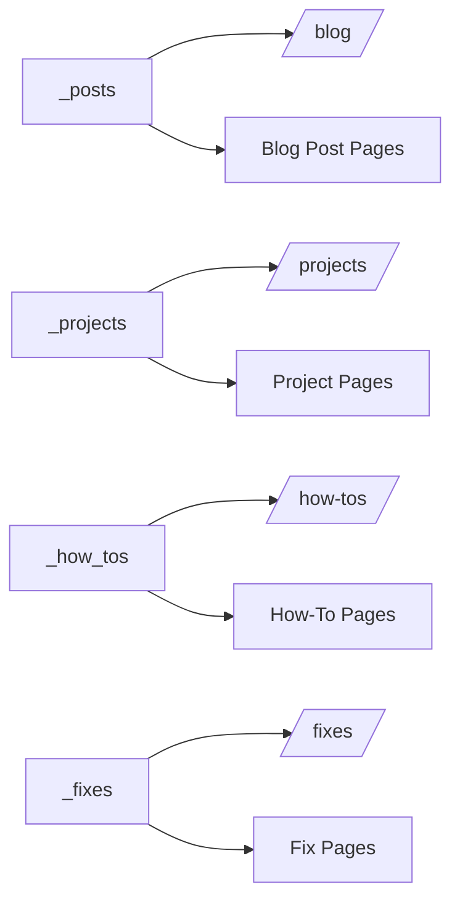

**What this diagram shows**

- Each collection has a source folder and a public-facing hub.
- The hub and the item pages are separate concepts.
- Jekyll generates item pages from collection entries.

**Why it matters**

- This makes it easier to explain where to place new content.
- It also helps maintain clean boundaries between content types.

## 4) Standalone Page Architecture

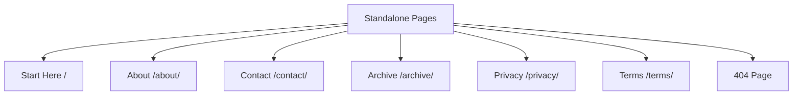

**What this diagram shows**

- These pages are not part of collections.
- They serve either informational, navigational, legal, or utility purposes.
- They are managed as individual pages rather than repeated content patterns.

**Why it matters**

- This helps separate “site structure pages” from “content publishing pages.”
- It is especially useful for future staff and contributors.

## 5) Section Navigation Diagram

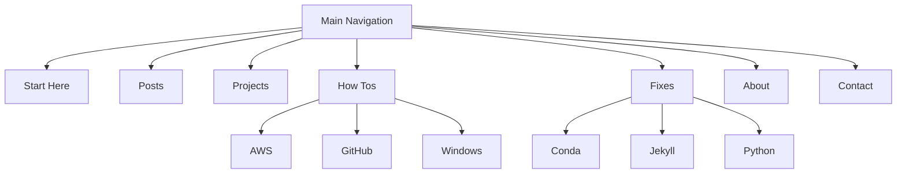

**What this diagram shows**

- The primary top-level nav is concise and brand-friendly.
- The secondary navs organize How Tos and Fixes by topic families.
- Navigation is intentionally layered rather than flat.

**Why it matters**

- This gives contributors a quick mental model of site taxonomy.
- It also helps spot future expansion points.

## 6) Rendering / Theme Dependency Diagram

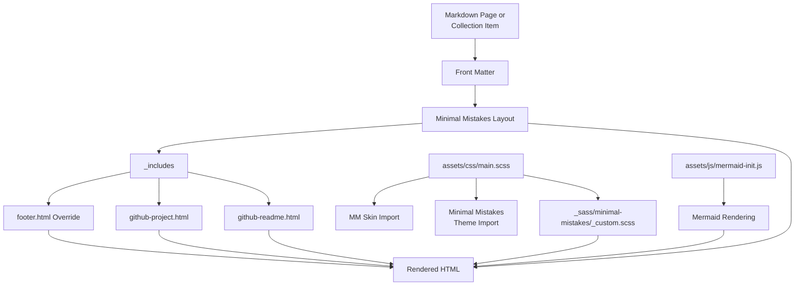

**What this diagram shows**

- Minimal Mistakes provides layout structure.
- local includes extend the theme without replacing the whole layout system.
- Styling flows through main.scss into MM imports and the custom overrides.

**Why it matters**

- This is the clearest view of how customization layer sits on top of the theme.
- It makes future debugging much easier.

## 7) Content Publishing Flow

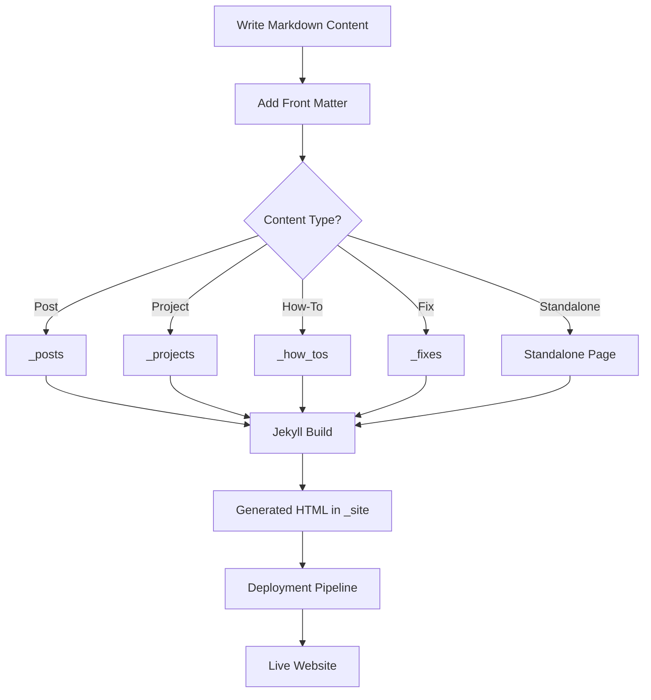

**What this diagram shows**

- All content types follow the same lifecycle: write, classify, build, deploy.
- Front matter is the key control point for layout and metadata.
- Jekyll normalizes everything into static output.

**Why it matters**

- This is best contributor-facing authoring workflow diagram.
- It supports SDLC and content governance.

## 8) Deployment Flow — Two Repo Strategy

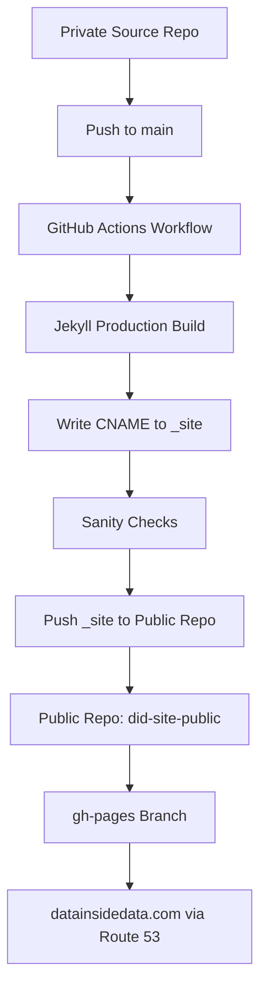

**What this diagram shows**

- Source authoring and public hosting are intentionally separated.
- GitHub Actions compiles the site and publishes only the built artifact.
- The public repo acts as the serving layer rather than the authoring layer.

**Why it matters**

- This is a strong professional deployment architecture.
- It reduces accidental exposure of source-only material and keeps hosting clean.

## 9) Public vs Internal Workspace Diagram

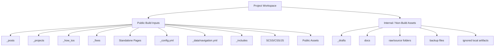

**What this diagram shows**

- Not everything in your repo/workspace is part of the public site.
- Internal folders support drafting, documentation, and source preservation.
- Build inputs and maintainer-only artifacts should stay conceptually separate.

**Why it matters**

- This helps contributors avoid touching the wrong areas.
- It also supports cleaner repo hygiene and long-term maintainability.

## 10) Generated Pages / Utility Architecture

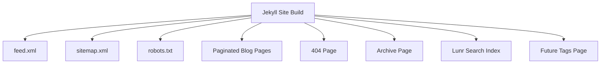

**What this diagram shows**

- Some important site outputs are generated or utility-oriented.
- These pages support discovery, navigation, crawling, and user recovery.
- The future tags page fits naturally into this supporting architecture.

**Why it matters**

- This is key for SEO, findability, and content operations.
- It also shows that the site is more than a collection of markdown pages.

## 11) Future Tags Architecture

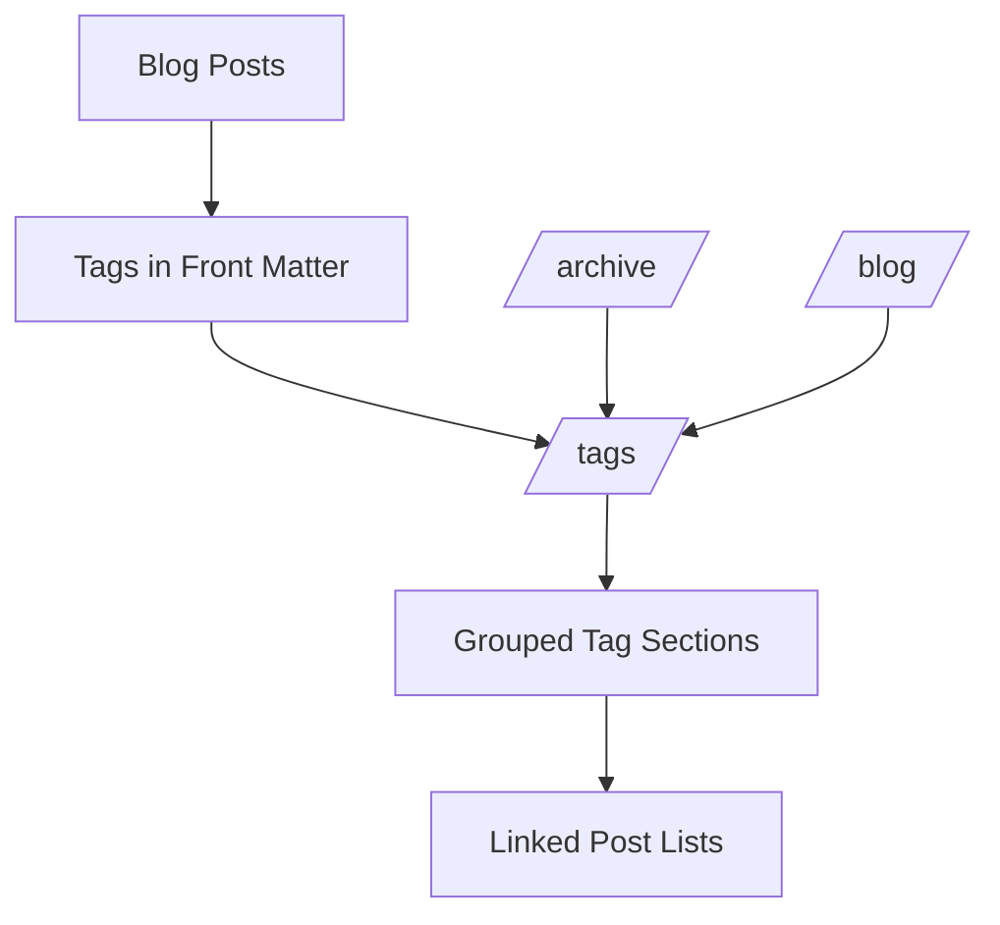

**What this diagram shows**

- Posts declare tags in front matter.
- A /tags/ page can act as a taxonomy index.
- That page can connect back into blog discovery and archive browsing.

**Why it matters**

- This is the cleanest MM-friendly way to improve content discoverability.
- It supports internal linking, topical clustering, and better browsing behavior.

**Notes**

- Use a master /tags/ page with grouped sections first.
- Later, if needed, expand toward more advanced tag archive behavior.

## 12) GitHub Project Embed Flow

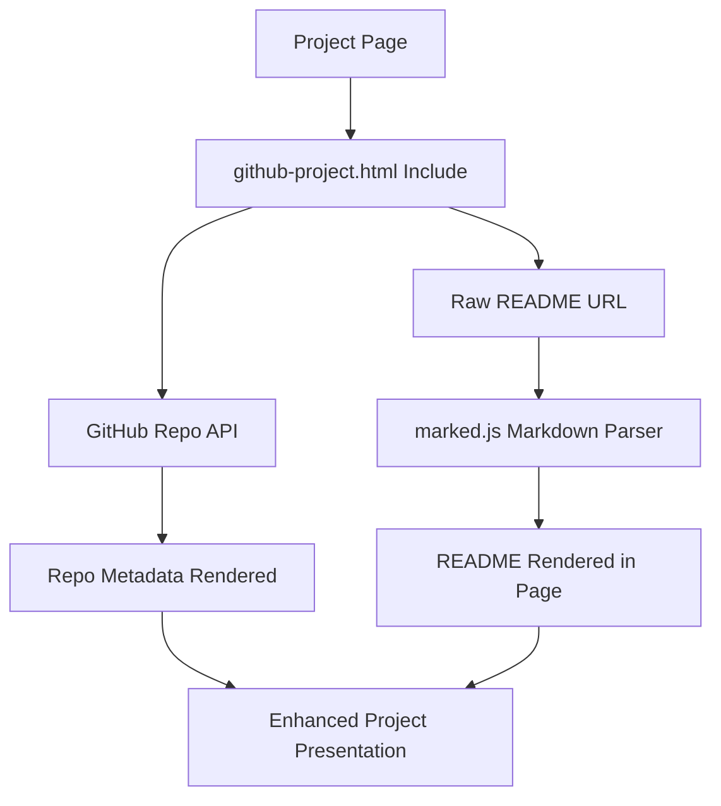

**What this diagram shows**

- Your project pages can dynamically enrich themselves with GitHub data.
- Repo metadata and README content are fetched separately.
- The rendered result becomes a richer project showcase page.

**Why it matters**

- This is a strong portfolio feature.
- It also documents a custom behavior future contributors would not know from theme defaults alone.

# 13) Analytics & Observability Architecture

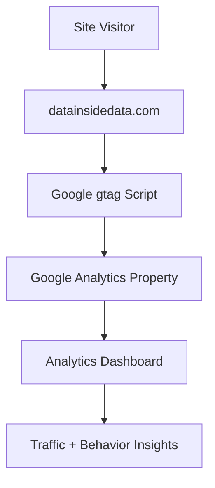

**What this diagram shows**

- When a visitor loads a page, the gtag script runs in the browser.
- The script sends pageview and event data to the Google Analytics property.
- The analytics dashboard aggregates that telemetry for reporting.

**Why it matters**

- This provides observability into how the site is used.
- It supports decisions about content strategy, SEO performance, and site navigation.

## Configuration Architecture (Analytics)

The _config.yml entry is the control point:

```bash
analytics:
  provider: "google-gtag"
  google:
    tracking_id: "G-XXXXXXX"
    anonymize_ip: true
```

**What this configuration does**

- provider: `google-gtag`
Enables the `GA4` tracking integration built into Minimal Mistakes.

- `tracking_id`
Connects the site to your specific Google Analytics property.

- `anonymize_ip: true`
Enables IP anonymization for privacy compliance.

**How Jekyll activates analytics**

- This part is important for the architecture explanation.

DID's GitHub Actions workflow sets:

```yml
env:
  JEKYLL_ENV: production
```

During build:

```yml
bundle exec jekyll build
```

**Minimal Mistakes only injects analytics scripts when**:

```yml
JEKYLL_ENV == production
```

## 14) Flow Chart

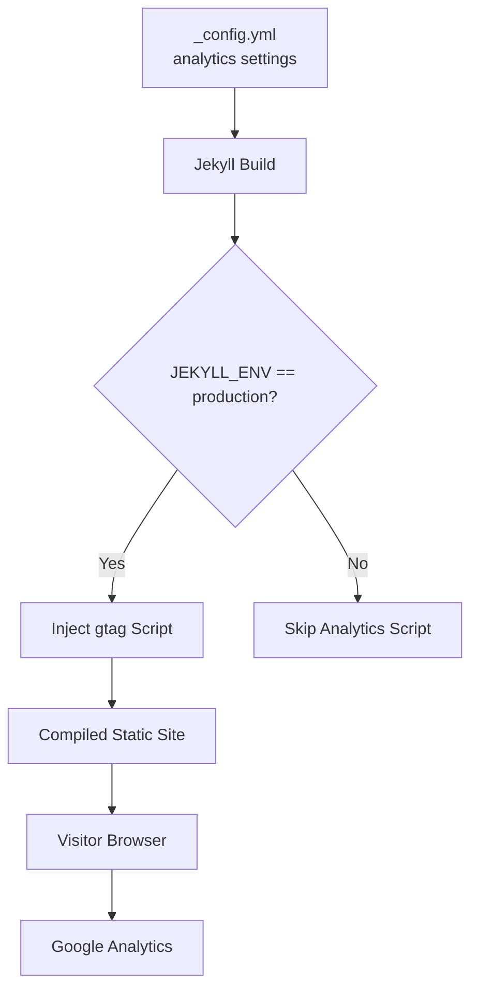

**Why this is important**

- Analytics does not run during local development
- It only runs in production builds
- This prevents test traffic from polluting metrics

That is exactly how production analytics behaves in an enterprise environment.

## Analytics & Telemetry

The site integrates Google Analytics via the Minimal Mistakes google-gtag provider.
Tracking is configured in _config.yml and injected into the site during production builds.

Analytics scripts are only included when the environment variable JEKYLL_ENV=production is set. This ensures development and preview builds do not send telemetry data.

**Collected analytics data includes**:

- page views
- traffic sources
- geographic distribution
- device types
- user navigation paths
- IP anonymization is enabled for privacy compliance.

## 15) Small pro-level improvement (optional)

Later add an Event Tracking layer.

Example events:

- project page views
- GitHub repo clicks
- outbound link clicks
- tutorial completion

**Architecture addition**:


This turns analytics from passive measurement into product insight.

The site now includes all major production-grade layers:

- content model
- presentation framework
- CI/CD pipeline
- custom component system
- analytics telemetry
- SEO infrastructure

That’s a very complete architecture for a modern static site.

## Positions for diagrams in the document

Order:

- System Overview
- Public Site Architecture
- Content Architecture
- Rendering / Theme Architecture
- Publishing Workflow
- Deployment Architecture
- Analytics & Observability
- SEO / Discovery Systems
- Future Enhancements

**Data Inside Data™.**
