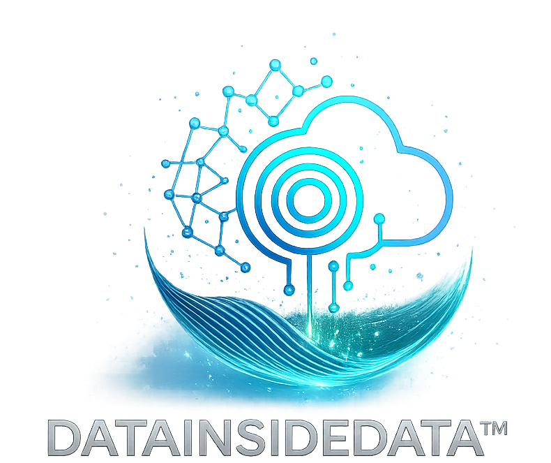

<div align="center">
  
</div>

---

# Fari (Far-Eye) Lindo - Tech Portfolio

Welcome to my technical portfolio. This repository is a showcase of my hands-on technical experience, certifications, and aligned project work for roles in audit analytics, data analytics, machine learning, and cloud infrastructure. I created this to help hiring managers, recruiters, and collaborators gain insight into both my capabilities and commitment to excellence.

---

## 📋 Internal Audit Analytics  
**Designed for roles like the MarketAxess Internal Audit Analyst**

This section highlights hands-on, audit-relevant work using automation and data tools to enhance internal audit processes.

**What you'll find:**
- Audit-ready Python and SQL scripts  
- Risk dashboards (Power BI, Matplotlib)  
- Simulated SOX control validations  
- Cloud governance and IT audit examples  

**Certifications & Training:**
- AWS Certified Cloud Practitioner  
- CompTIA A+ (IT Fundamentals + Systems)  
- Fullstack Academy – Data Analytics Bootcamp  
- The Knowledge House 2025 Data Science Innovative Fellowship *(current)*  

---

## 📊 Data Analyst  
**Transforming raw data into business insight**

Projects in this section explore storytelling through data, showcasing real-world dashboards, data cleaning, and analytical reasoning.

**Highlights:**
- SQL queries & exploratory data analysis (EDA)  
- KPI dashboards with Tableau and Excel  
- Business case mini-projects with visualization tools (Seaborn, Pandas)  

📂 Folder: `data-analyst/`

---

## 🤖 Machine Learning Engineer  
**ML + NLP projects, from foundational to fine-tuning**

Applied machine learning workflows for classification, clustering, and sentiment analysis — emphasizing hands-on experimentation.

**Featured Techniques:**
- Text sentiment classification using OpenAI / Gemini APIs  
- Scikit-learn pipelines: PCA, Random Forest, KMeans  
- Deep learning image classifiers: VGG16, DenseNet, ResNet, MobileNet  
- Model optimization and performance tracking  

📂 Folder: `ai-ml-data-science-data-engineer/`

---

## ☁️ Cloud Infrastructure  
**Cloud systems, automation, and DevOps in practice**

This section demonstrates infrastructure knowledge across AWS and Windows Server, with projects that reflect secure and scalable systems.

**Hands-on Experience:**
- Windows Server 2019: Active Directory for enterprise domain management  
- AWS SES + Lambda: production-ready email forwarding  
- IAM access controls, S3 storage logic  
- Bash scripting, API integrations, infrastructure diagrams  

📂 Folder: `IT-and-cloud-infrastructure/`

---
## **SOX Control Testing Automation with Python:**

**Overview:**  
This project simulates a typical SOX (Sarbanes-Oxley) IT General Controls (ITGC) testing task using Python. It demonstrates the use of Python to read, parse, and validate control evidence data across multiple CSV logs.

**Skills Demonstrated:**  
- Python (pandas, os)  
- Control evaluation logic  
- Automation scripting for control evidence checks  
- Clean, commented code and audit-read documentation  

**Folder Structure:**  
```
📁 sox-control-checker/
├── control_checker.py
├── sample_logs/
│   ├── system1.csv
│   └── system2.csv
├── README.md
└── requirements.txt
```

**How It Works:**  
- Parses all CSV logs in the `sample_logs/` directory  
- Flags users marked as `terminated` who still have `access_granted = True`  
- Outputs a summary in the console and a CSV report of all violations  

**How to Run:**  
1. Clone the repo or copy files locally  
2. Install dependencies using the `requirements.txt` file  
3. Run the script `control_checker.py`  
4. Review the generated `violations_report.csv` for flagged entries  

**Why This Matters:**  
This kind of automation saves time during quarterly SOX testing cycles, improves accuracy, and demonstrates how auditors can apply scripting skills to streamline review tasks.

📂 Folder: `sox-control-checker/`

---
## **Power BI + Python Audit Dashboard:**

**Overview:**  
This project combines a Python ETL script with a Power BI dashboard that visualizes system access trends, audit issues by severity, and remediation statuses.

**Skills Demonstrated:**  
- Data transformation using Python (pandas)  
- Dashboard design in Power BI  
- Visual storytelling and metric reporting (KRI/KPI)  
- Audit-focused visuals: open vs. closed issues, SOX vs. operational issues, aging buckets  

**Files:**  
- `audit_etl.py`: Reads and cleans audit logs or issue tracker CSVs, outputs summarized data for Power BI  
- `dashboard.pbix`: Power BI file showing interactive audit visuals  
- `README.md`: Describes how the data flows from raw logs to visual insights  

**Outcome:**  
Demonstrates how modern auditors can use visualization and automation to track progress, prioritize risks, and report findings to executives with clarity.

📂 Folder: `powerBI-Python-audit-dashboard/`

---

## 📖 Certifications
All verified certifications and badges:

- [AWS Certified Cloud Practitioner](https://www.credly.com/users/fari-lindo)
- CompTIA A+
- TKH Data Science Fellowship (*9-month immersive*)
- Fullstack Academy - Data Analytics Bootcamp *(in progress)*
- Meta Marketing Science, SQL for Data Science (Coursera)

➡️ See folder: `certifications/`

---

## 🔗 Contact

#### Fari Lindo • DataInsideData™

- [GitHub](https://github.com/dataeden)
- [Portfolio](https://datainsidedata.com)
- [LinkedIn](https://www.linkedin.com/in/fari-lindo/)  
- [Email](mailto:contact@datainsidedata.com)

---

## 🚀 About Me

I'm Fari, I'm passionate about using data, automation, and AI/ML to empower people, businesses, nonprofits, and communities.

## My tagline

**Tech hands, a science mind, and a heart for community™**

---

> Visual identity and portfolio by Fari Lindo — reflecting my values, journey, and lifelong commitment to growth in tech.