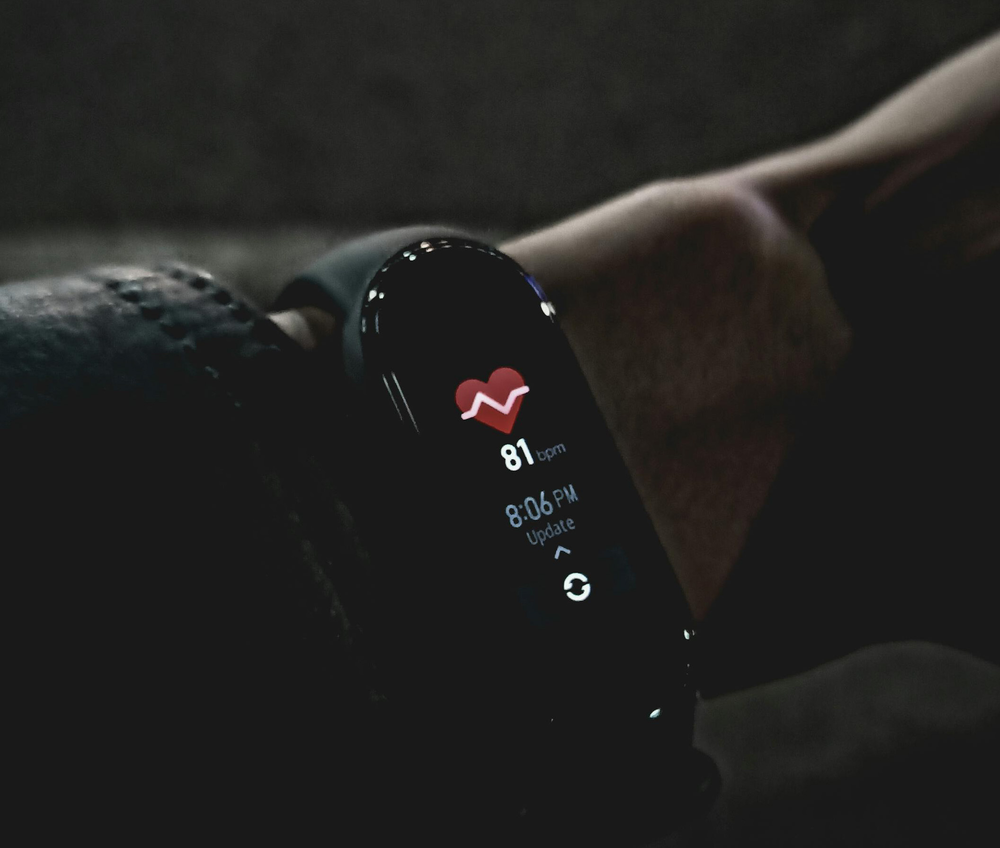
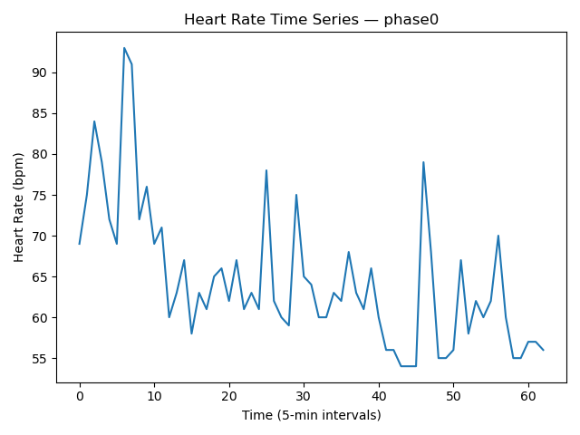
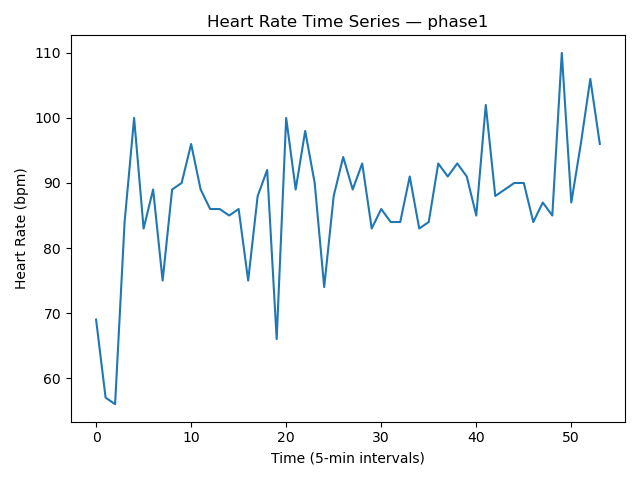
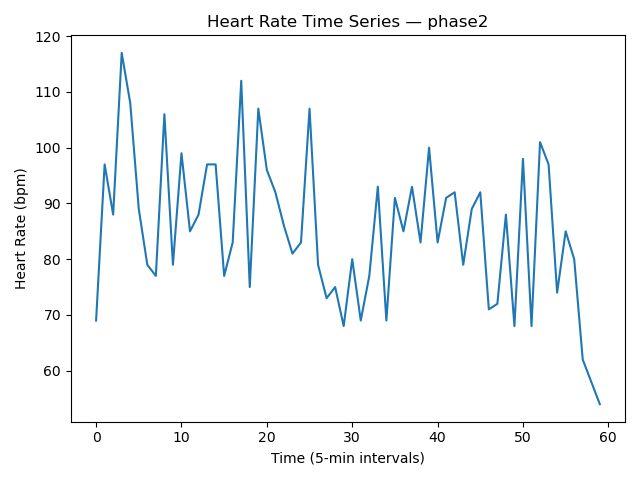
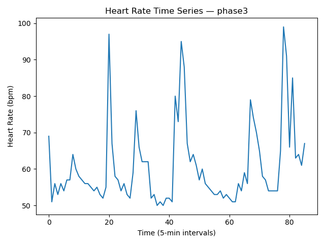

<div align="center">
  

  <p>
    <em>Photography by Alfin Auzikri.</em>
  </p>
</div>

# Wearable Health Signal Analysis

> Part of the DataInsideData™ technical portfolio monorepo.

### Fari Lindo • DataInsideData™

#### Role: Data Analyst (Portfolio Project)

#### Health-Tech Case Study | Time-Series Behavioral Inference | Python

---

## Tech Stack


---

 


[](LICENSE)

---

## Executive Summary

This project simulates an early-stage wearable health analytics pipeline designed to transform raw heart-rate telemetry into actionable behavioral insights.

Using 8 hours of heart-rate data sampled at 5-minute intervals, the system:

- Cleans corrupted sensor inputs
- Computes descriptive statistics from scratch (no statistical libraries)
- Generates reproducible time-series visualizations
- Infers behavioral states (sleep, exercise, awake activity) using rule-based statistical profiling

The architecture emphasizes modular design and test-driven development (TDD) to ensure analytical integrity, reproducibility, and production readiness.

This prototype models the foundational logic required for a scalable sleep-quality scoring engine and wearable behavioral classification system.

---

## 📊 Statistical Phase Summary

| Phase  | Mean (bpm) | Max (bpm) | Std Dev (bpm) | Behavioral Classification |
|--------|------------|-----------|---------------|---------------------------|
| Phase0 | 64.59      | 93        | 8.53          | Deep / Stable Sleep       |
| Phase1 | 87.30      | 110       | 9.90          | Awake Activity            |
| Phase2 | 85.18      | 117       | 13.38         | Exercise                  |
| Phase3 | 60.65      | 99        | 11.00         | Light / Disturbed Sleep   |

> **Classification Note:**  
> Behavioral states are inferred using descriptive statistics only.
> - Mean heart rate represents overall intensity
> - Maximum heart rate captures peak exertion 
> - Standard deviation is used as a variability proxy
>
> This rule-based classification is intended as a prototype foundation and does not replace clinical-grade analysis.

---

## 🔎 Key Insights

- **Phase0** demonstrates the most stable physiological pattern (mean = 64.59 bpm, σ = 8.53), indicating deep or sustained sleep.
- **Phase3** shows the lowest mean (60.65 bpm) but elevated variability, suggesting lighter or disturbed sleep.
- **Phase2** exhibits the highest maximum heart rate (117 bpm) and the greatest volatility (σ = 13.38), consistent with structured exercise.
- **Phase1** represents moderate intensity and variability, aligning with typical awake activity.

Overall, volatility (standard deviation) proved to be the strongest differentiator between sleep and exercise phases.

---

## 📈 Visual Highlights

> Plots generated programmatically via `main.py` to ensure reproducibility.

### Phase0 — Deep / Stable Sleep



*Lower mean and stable rhythm across time indicate sustained sleep patterns.*

---

### Phase1 — Awake Activity



*Moderate baseline with periodic fluctuations suggests routine daytime movement.*

---

### Phase2 — Exercise



*Sustained elevated heart rate and high variability reflect structured exertion.*

---

### Phase3 — Light / Disturbed Sleep



*Lower baseline with intermittent volatility may represent lighter sleep or transitional states.*

---

## Dataset Overview

- 4 time-series data files (`phase0–phase3`)
- Sampling rate: every 5 minutes
- Mixed-quality telemetry (numeric values + corrupted entries such as `"NO DATA"`)

Each file represents a distinct physiological state during the monitoring window.

## Architecture

```text

wearable-health-signal-analysis/
│
├── data/
│   ├── phase0.txt
│   ├── phase1.txt
│   ├── phase2.txt
│   └── phase3.txt
│
├── images/
│   ├── phase0_hr_data.png
│   ├── phase1_hr_data.png
│   ├── phase2_hr_data.png
│   └── phase3_hr_data.png
│
├── .gitignore
├── cleaner.py
├── config.py
├── LICENSE
├── main.py
├── metrics.py
├── README.md
├── requirements.txt
├── test_cleaner.py
├── test_metrics.py
├── test_run.py
└── writeup.md
```

---

## Module Responsibilities

### cleaner.py

- Removes corrupted entries
- Validates numeric-only strings
- Converts values to integers

### metrics.py

- Implements mean, max, variance, and standard deviation manually
- Avoids statistical libraries to demonstrate computational reasoning

### main.py

- Coordinates file I/O
- Executes cleaning pipeline
- Computes metrics
- Generates phase-specific visualizations

---

## Data Cleaning Strategy

Wearable devices frequently generate imperfect telemetry due to:

- Sensor detachment
- Motion artifacts
- Bluetooth transmission loss
- Device buffering interruptions

The cleaning layer removes invalid entries while preserving valid
physiological readings for downstream analysis.

> In a production system, missingness would also be logged as a signal-quality metric.

---

## Behavioral Inference Logic

Behavioral state classification is derived from statistical profiling:

### Sleep

- Lower mean
- Lower maximum
- Lower variability

### Exercise

- Elevated maximum
- Increased variability
- Sustained elevated heart rate segments

### Awake Activity

- Moderate mean
- Moderate variability
- Less sustained intensity than exercise

This mirrors common physiological patterns observed in consumer wearable devices.

---

## Visual Evidence

Generated time-series plots are saved to:

```markdown
    images/
```

Each phase produces an independent visualization to prevent overwrite and support comparative review.

---

## Analytical Techniques Demonstrated

- Time-series signal processing
- Numeric validation and coercion
- Manual statistical computation
- Phase segmentation
- Behavioral pattern inference
- Test-driven development workflow
- Visualization using matplotlib

---

## Limitations

- Heart rate alone cannot definitively classify behavioral states.
- No accelerometer or HRV (R--R interval) data included.
- Missingness is filtered rather than analyzed.
- Variance is used as a volatility proxy rather than full HRV analysis.

---

## How to Run

> Python 3.10+ recommended.

### 1. Clone the Portfolio Repository

```bash
git clone https://github.com/dataeden/fari-tech-portfolio.git
cd fari-tech-portfolio/data-analysis/wearable-health-signal-analysis
```

### 2. Create Virtual Environment (Recommended)

```bash

python -m venv venv
source venv/bin/activate      # Mac/Linux
venv\Scripts\activate         # Windows
```

### 3. Install Dependencies

```bash
pip install -r requirements.txt
```

### 4. Run Tests (Test-Driven Validation)

```bash
python test_cleaner.py
python test_metrics.py
python test_run.py
```

### 5. Run a Specific Phase Manually

```bash
python main.py
```

**Generated visualizations will be saved to**:

```markdown
images/
```

> All statistical computations are implemented manually using base Python to demonstrate foundational understanding.

---

## Future Enhancements

### Analytical Extensions

- Rolling-window heart-rate variability metrics
- Anomaly detection
- Spike classification
- Transition detection between states

### Product-Level Extensions

- Sleep scoring algorithm (v1)
- Rule-based → ML classification pipeline
- Streamlit dashboard deployment
- Real-time ingestion capability

---

## Key Skills Demonstrated

- Modular Python architecture
- Statistical reasoning without external libraries
- Test-driven development
- Health-tech analytics
- Time-series interpretation
- Data cleaning pipelines
- Visualization best practices

---

## Why This Project Matters

Wearable health analytics sits at the intersection of:

- Signal processing
- Behavioral modeling
- Data quality engineering
- Applied statistics

This prototype demonstrates the foundational logic behind sleep and activity inference systems used in modern consumer wearables.

---

## Contact

#### Fari Lindo • DataInsideData™

- [GitHub](https://github.com/dataeden)
- [Portfolio](https://datainsidedata.com)
- [LinkedIn](https://www.linkedin.com/in/fari-lindo/)  
- [Email](mailto:contact@datainsidedata.com)

*Tech Hands, a Science Mind, and a Heart for Community™*
