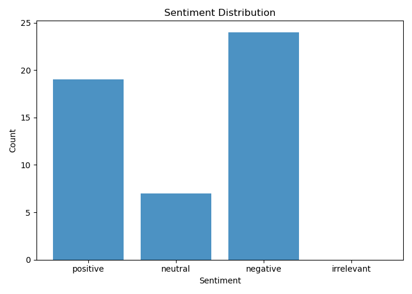

<div align="center">
  

  <p>
    <em>Photography by Abdul Kayum.</em>
  </p>
</div>

# 🤖 AI Review Sentiment Labeling Pipeline

## OpenAI API Review Classification System

> Part of the DataInsideData™ technical portfolio monorepo.  
> Applied AI, Sentiment Analysis, Prompt Engineering & Automated Decision Systems.

#### Fari Lindo • Analyst / AI Systems Builder

---

## Tech Stack


---


[](LICENSE)

---

## Executive Overview

This project implements a Python-based review processing pipeline that uses the OpenAI API to classify customer reviews into four sentiment categories:

- Positive
- Neutral
- Negative
- Irrelevant

The system reads review data from a JSON file, sends cleaned review text to an OpenAI language model, receives structured sentiment labels, saves the output, and generates a visualization summarizing sentiment distribution.

The original assignment focused on completing a basic API labeling workflow. This portfolio version reframes the work as a lightweight AI decision system for customer feedback analysis.

---

## Core Problem

Businesses often collect large volumes of customer reviews but lack an efficient way to quickly summarize customer sentiment.

This project explores how a language model can support early-stage review intelligence by automatically labeling free-text feedback.

The pipeline answers:

> Can an LLM classify product reviews into useful sentiment categories with enough consistency to support exploratory customer insight analysis?

---

## Core Finding

The labeled sample showed that **negative sentiment** was the most common category among the reviewed coconut water product feedback.

This suggests customer dissatisfaction was concentrated around product experience issues such as:

- Taste
- Packaging
- Freshness
- Perceived product quality
- Flavor consistency

The analysis also revealed an important AI systems lesson: model output quality depends heavily on preprocessing, prompt structure, and safeguards that align the number of returned labels with the number of input reviews.

---

## Project Objectives

This project was designed to:

1. Build a minimal Python pipeline for automated review labeling.
2. Use the OpenAI API to classify product review sentiment.
3. Apply prompt engineering to improve structured model output.
4. Validate the workflow through test-driven development.
5. Visualize sentiment distribution across labeled reviews.
6. Reflect on reliability, hallucination risk, and production readiness.

---

## Sentiment Labeling Framework

Each review is classified into one of four categories:

| Label | Meaning |
|---|---|
| Positive | The review expresses satisfaction, approval, or enthusiasm. |
| Neutral | The review is mixed, factual, or only mildly opinionated. |
| Negative | The review expresses dissatisfaction, frustration, or criticism. |
| Irrelevant | The review does not meaningfully relate to the product. |

Example input:

```json
[
  "I love this drink and buy it every week.",
  "It is okay, but I probably would not order it again.",
  "The product arrived damaged and tasted stale.",
  "I like strawberry ice cream."
]
```

## Example Output

```json
[
  "positive",
  "neutral",
  "negative",
  "irrelevant"
]
```

## Pipeline Overview

```text
reviews.json
   ↓
main.py
   ↓
label.py
   ↓
OpenAI API sentiment classification
   ↓
Output_Response/
   ↓
visualize.py
   ↓
images/sentiment_distribution.png
```

---

## Visual Evidence

### Sentiment Distribution



*<div align="center"> The visualization summarizes the frequency of each sentiment label returned by the OpenAI-powered classification pipeline. </div>*

---

## Analytical Questions

1. What was the most common sentiment?

Negative sentiment was the most common sentiment observed across the sample of 50 reviews.

This indicates that customers were more likely to express dissatisfaction than approval in the available sample.

2. How reliable were the labels?

The labels were useful for exploratory analysis, but not perfect.

During testing, the model occasionally returned more labels than expected. This appeared to happen when messy review text included HTML tags, escaped characters, line breaks, or formatting artifacts.

To reduce this issue, preprocessing and output safeguards were added, including:

```bash
sentiments = sentiments[:len(reviews)]
```

This helped ensure that the number of returned sentiment labels matched the number of input reviews.

However, this also highlights a key production concern: LLM outputs should not be trusted blindly. Automated labeling systems need validation, cleaning, schema checks, and possibly human review before being used for high-stakes business decisions.

3. What should the producer improve?

Based on the negative sentiment concentration, the producer has a clear opportunity to improve customer satisfaction.

Recurring review themes suggest the business should investigate:

- Product taste
- Packaging quality
- Freshness and shelf stability
- Formula consistency
- Customer expectations around flavor

Some customers responded positively to specific flavors, especially mango, which suggests the company should not abandon the product line entirely. Instead, the business should identify which flavors perform best and use negative feedback to improve weaker product variants.

## System Design Notes

This project is intentionally small, but it demonstrates several important AI system design concepts:

- Prompt-controlled classification
- Structured response expectations
- API-based labeling
- Input validation
- Output alignment checks
- Basic hallucination mitigation
- Reproducible test-driven development
- Visualization of model-generated labels

## Directory Structure

```text
ai-review-sentiment-labeling-pipeline/
│
├── data/
│   └── reviews.json
│
├── images/
│   └── sentiment_distribution.png
│
├── Output_Response/
│   └── labeled_reviews.json
│
├── config.py
├── label.py
├── main.py
├── visualize.py
│
├── test_label.py
├── test_package.py
├── test_run.py
├── test_visualize.py
│
├── README.md
└── writeup.md
```

## Key Modules

`label.py`

Handles review classification using the OpenAI API.

**Responsibilities**:

- Validate input format.
- Build the system prompt.
- Send review text to the model.
- Return sentiment labels.
- Guard against malformed or mismatched outputs.

`main.py`

Runs the end-to-end pipeline.

**Responsibilities**:

- Load review data from JSON.
- Extract review text.
- Call the labeling function.
- Save generated sentiment labels.
- Return the final label list.

`visualize.py`

Generates a sentiment distribution chart.

**Responsibilities**:

- Count each sentiment category.
- Create a visualization.
- Save the chart to the images/ folder.
- Methods & Analytical Framework

**This project applies**:

- API-based text classification
- Prompt engineering
- JSON file handling
- Sentiment category design
- Test-driven development
- Basic model evaluation
- Error inspection
- Data visualization

## Limitations

This project is an MVP and has several limitations:

- Small review sample size
- No human-labeled benchmark comparison
- Limited sentiment categories
- Possible model hallucinations
- Output inconsistency risk
- No confidence scores
- No batch retry or rate-limit handling
- No production logging or monitoring layer

## Future Improvements

Future versions could include:

- Human-labeled validation data
- Accuracy, precision, recall, and confusion matrix reporting
- Confidence scoring
- Better review preprocessing
- Batch processing with retries
- Structured JSON schema enforcement
- Prompt version tracking
- Model comparison across multiple OpenAI models
- Dashboard for review trends
- Topic modeling to identify common complaint themes

## Production Readiness Reflection

This project demonstrates how quickly an LLM-powered labeling workflow can be prototyped.

However, for production use, the system would need stronger safeguards:

- Deterministic structured output
- Input cleaning and normalization
- Rate-limit handling
- Error logging
- Review-label alignment validation
- Human review loop for uncertain labels
- Monitoring for model drift or inconsistent outputs

The biggest takeaway is that LLMs are powerful for classification support, but they should be wrapped inside a reliable software and evaluation layer.

## Attribution

This project originated as a review sentiment labeling exercise during The Knowledge House fellowship.

The original assignment focused on implementing a basic OpenAI API pipeline. The portfolio version was independently reframed and expanded as an applied AI decision system under DataInsideData™.

All interpretation, system framing, reliability analysis, and portfolio documentation were rebuilt for professional presentation.

## How to Run

`Python 3.10+` recommended.

This project is part of the analytics-ai-decision-systems folder inside the DataInsideData™ technical portfolio monorepo.

Clone the Portfolio Repository

```bash
git clone https://github.com/dataeden/fari-tech-portfolio.git
cd fari-tech-portfolio
```

Navigate to This Project

```bash
cd analytics-ai-decision-systems/ai-review-sentiment-labeling-pipeline
```

Create a Virtual Environment

```bash
python -m venv venv
```

Activate the environment:

```bash
# Mac / Linux
source venv/bin/activate

# Windows
venv\Scripts\activate
```

Install Dependencies

```bash
pip install -r requirements.txt
Add the OpenAI API Key
```

Create a `.env` file or configure the environment variable securely.

Example:

```bash
OPENAI_API_KEY="your_api_key_here"
```

Never commit API keys to GitHub.

## Run Tests

```bash
python test_package.py
python test_label.py
python test_visualize.py
python test_run.py
Run the Pipeline
python main.py
```

## Contact

#### Fari Lindo • DataInsideData™

- [GitHub](https://github.com/dataeden)
- [Portfolio](https://datainsidedata.com)
- [LinkedIn](https://www.linkedin.com/in/fari-lindo/)  
- [Email](mailto:contact@datainsidedata.com)

---

*Data Inside Data*.

*Tech Hands, a Science Mind, and a Heart for Community™*.
