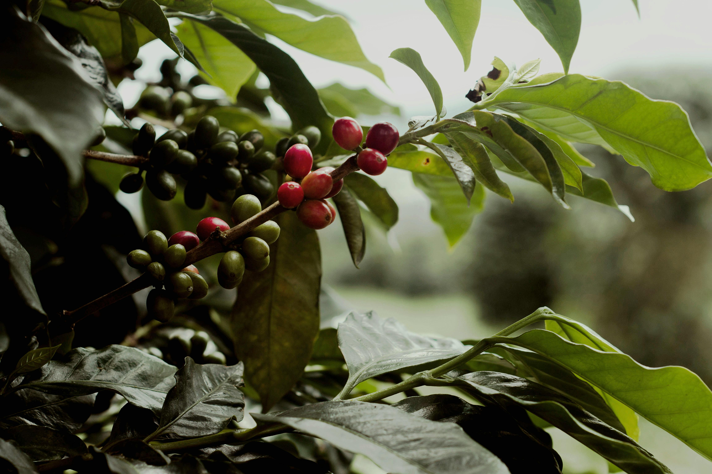
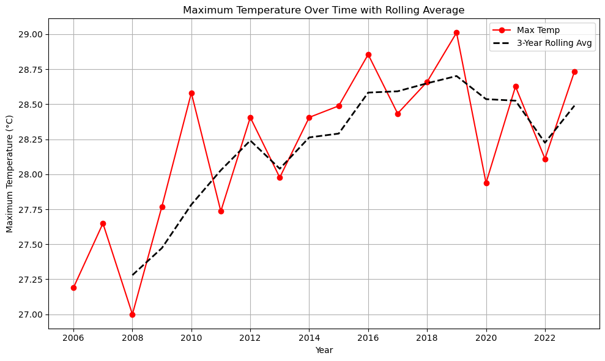
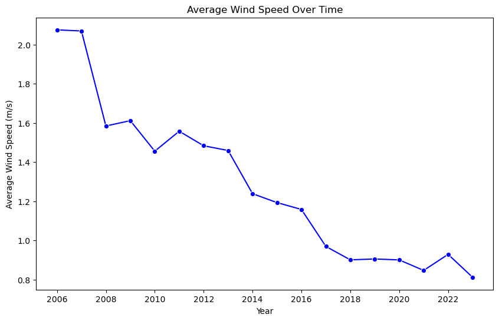
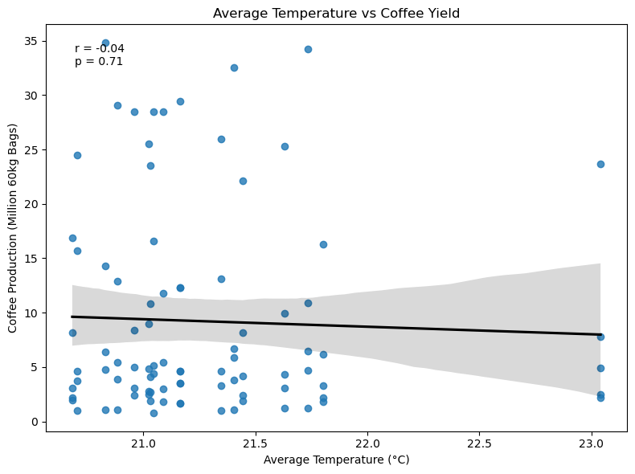
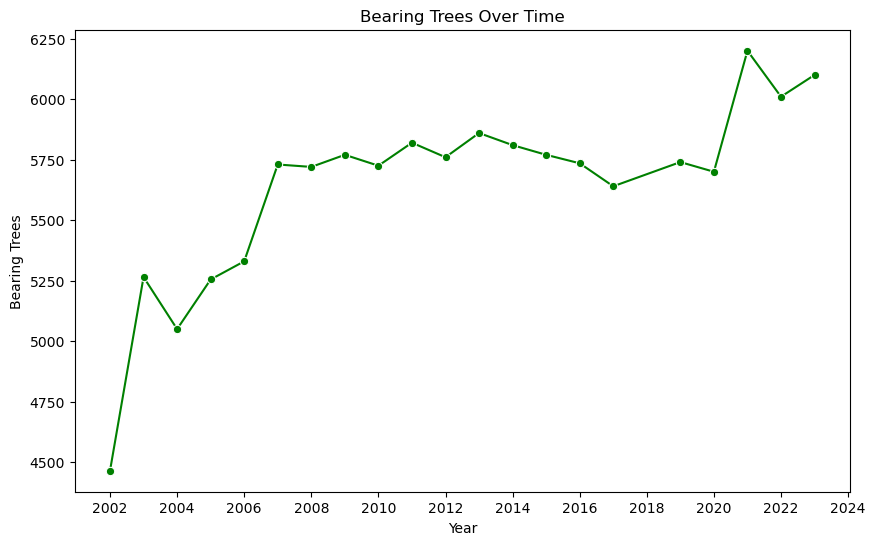
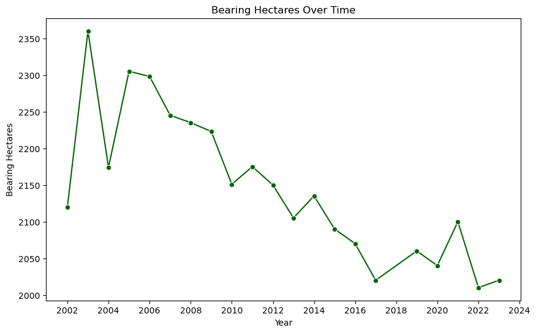
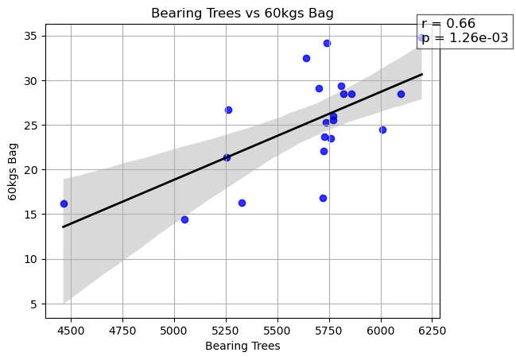

<div align="center">
  

  <p>
    <em>Photography by Azzam Zicc.</em>
  </p>
</div>

# ☕ Structural vs Climatic Drivers of Coffee Production  

## Minas Gerais, Brazil (2002–2023)

> Part of the DataInsideData™ technical portfolio monorepo.  
> Agricultural Data Analysis & Climatic Impact Modeling.

#### Fari Lindo • Analyst

---

## Tech Stack


---


[](LICENSE)

---

## Executive Overview

This study evaluates whether annual coffee production in Minas Gerais is primarily driven by:

- 🌦️ Climatic conditions (rainfall, temperature, humidity, wind)
- 🌱 Structural agricultural capacity (bearing trees, cultivated hectares)

Using multi-year growing-season weather data and structural production metrics, this analysis applies correlation testing, time-series trend evaluation, distribution testing, and quartile-based yield elasticity assessment to identify dominant output drivers.

### Core Finding

Coffee production growth from 2002–2023 is more strongly associated with **structural capacity variables** than with aggregated weather indicators. Bearing tree expansion and land optimization demonstrate statistically significant relationships with yield, while annual weather aggregates do not exhibit statistically significant linear associations within this dataset’s temporal resolution.

Although a gradual decline in minimum humidity was observed, no statistically significant linear relationship between humidity and annual production was detected. These findings suggest that structural agricultural strategy outweighs short-term climatic variability in explaining output trends at the annual level.

---

## Intended Audience

This project is designed for data analysts, agricultural researchers, policy stakeholders, and technical recruiters interested in applied statistical analysis, climate-risk research, and reproducible data workflows.

---

## 📊 Visual Evidence — Climatic Trend Analysis

### Maximum Temperature Trend (Rolling Average)


<div align="center">
Temperature shows cyclical variation without strong structural acceleration over time.
</div>

---

### Structural Wind Speed Decline



Average wind speed declined by approximately 60% between 2006 and 2023.  
Despite this structural climatic shift, production increased — suggesting wind is not a dominant yield driver.

---

### Weather vs Yield (Example: Avg Temperature)



- Pearson r ≈ -0.04  
- p ≈ 0.71  

The regression slope is effectively flat, indicating no statistically significant linear relationship between average temperature and coffee production.

> **Similar weak results were observed for rainfall and wind variables**.

---

## 🌱 Structural Agricultural Analysis

### Bearing Trees Expansion Over Time



<div align="center">
Bearing trees increased significantly over time, indicating structural agricultural expansion.
</div>

- Pearson r ≈ 0.78  
- p ≈ 3.38e-05  

**Shapiro-Wilk testing (p = 0.003) suggests non-normal distribution consistent with a trending time series**.

---

### Bearing Hectares Over Time



Cultivated land declined while production increased, suggesting efficiency gains and yield density optimization.

- Pearson r ≈ -0.82  

---

### Trees vs Yield



Structural expansion demonstrates a statistically significant positive association with yield (r ≈ 0.66).

---

### 📈 Structural vs Climatic Contrast

| Variable Type | Strong Trend Over Time | Strong Correlation with Yield |
|---------------|------------------------|-------------------------------|
| Temperature   | Mild                   | 👎 No | 
| Rainfall      | Volatile               | 👎 No |
| Wind Speed    | Yes (decline)          | 👎 No |
| Bearing Trees | Yes (increase)         | 👍 Yes |
| Hectares      | Yes (decline)          | Moderate (negative) |

<div align="center">
Structural agricultural capacity demonstrates stronger explanatory power than climatic variation within this study window.
</div>

---

## Research Objectives

This analysis evaluates the relative explanatory power of climatic versus structural agricultural variables in modeling annual coffee production outcomes.

Specifically, the study tests:

1. Whether key weather variables exhibit statistically meaningful structural trends over time.
2. Whether growing-season weather aggregates demonstrate significant linear association with annual production output.
3. Whether structural agricultural capacity metrics provide stronger predictive strength than climatic indicators.
4. Whether yield elasticity varies across structural capacity tiers (quartile stratification).
5. What data limitations constrain predictive modeling accuracy within an annual aggregation framework.

---

## Data Sources

### 1️⃣ Weather Dataset  

**Scope:** January–May growing season (annual aggregates)  
**Region:** Minas Gerais  

Columns include:

- `rain_max`
- `temp_avg`, `temp_min`, `temp_max`
- `hum_min`, `hum_max`
- `wind_avg`, `wind_max`

Two split files (`coffee_output.csv`, `weather_data.csv`) were programmatically merged into: ``weather_merged``

---

### 2️⃣ Coffee Production Dataset  

**Harvest Period:** June–September  
**Region Filtered:** Minas Gerais only  

Key structural variables:

- `bearing_trees`
- `nonbearing_trees`
- `bearing_hectares`
- `60kgs_bag` (million bags)

Null rows were removed prior to analysis.

---

## Analytical Structure

This project is divided into three notebooks:

```diagram
notebooks/
├── explore_weather.ipynb
├── explore_coffee.ipynb
└── analysis.ipynb
```

---

## Notebook 1 — Weather Trend & Internal Correlation Analysis

### Key Observations

- **Temperature:** Cyclical variation, no strong monotonic trend.
- **Minimum Humidity:** Gradual decline (~0.2% per year).
- **Wind Speed:** ~60% decline from 2006–2023.
- **Rainfall:** Episodic volatility rather than structural trend.

### Bivariate Relationships

| Variables | Pearson r | Significance |
|------------|------------|--------------|
| Rain vs Humidity | ~0.41 | Not significant |
| Wind vs Temperature | ~0.48 | Statistically significant |

Overall, internal weather relationships were moderate at best.

---

## Notebook 2 — Structural Agricultural Analysis

### Long-Term Structural Trends

| Variable | Pearson r (vs Year) | Interpretation |
|-----------|--------------------|----------------|
| Bearing Trees | ~0.78 | Strong upward expansion |
| Bearing Hectares | ~-0.82 | Significant land contraction |
| Production (60kg bags) | ~0.72 | Strong production growth |

### Production Relationships

| Variables | Pearson r | Interpretation |
|------------|------------|----------------|
| Bearing Trees vs Production | ~0.66 | Moderately strong positive |
| Bearing Hectares vs Production | ~-0.48 | Moderate negative |

This suggests improved yield density and structural optimization rather than land expansion as the primary driver of production growth.

---

## Notebook 3 — Weather vs Production Integration

After merging weather and production datasets:

### Weather vs Yield Correlations

| Weather Variable | Pearson r vs 60kg Bags | Significance |
|------------------|-------------------------|--------------|
| Avg Temp | ~-0.04 | Not significant |
| Min Humidity | ~-0.06 | Not significant |
| Max Rain | ~-0.02 | Not significant |
| Avg Wind | ~-0.13 | Not significant |

### Interpretation

Within the resolution of annual growing-season averages:

- No weather variable demonstrates meaningful predictive strength.
- Structural capacity variables exhibit stronger statistical association.

---

## Yield Elasticity Insight

Quartile stratification reveals:

- Lower capacity farms show higher marginal gains from expansion.
- Higher capacity tiers show diminishing returns.
- Land contraction may reflect efficiency gains rather than decline.

This introduces a structural elasticity framework rather than a climate-dominant narrative.

---

## Limitations

- Annual aggregates mask monthly volatility.
- No soil, pest, fertilizer, or drought index data included.
- No commodity price or economic pressure modeling.
- Weather measurements lack intra-seasonal resolution.

---

## Future Data Recommendations

To improve modeling accuracy:

- Monthly rainfall & humidity variability
- Drought index (SPI)
- Soil moisture levels
- Leaf rust infection rates
- Fertilizer usage
- Commodity price elasticity
- Export demand indicators

---

## Strategic Implication

For Minas Gerais:

Within annual-resolution data, structural agricultural optimization demonstrates stronger statistical association with output growth than aggregated climatic indicators.

Weather volatility exists, but infrastructure and cultivation strategy appear more decisive.

---

## Directory Structure

```text
coffee-production-weather-analysis/
│
├── data/
│   ├── crop/
│   │   └── coffee_output.csv
│   │
│   └── weather/
│       ├── weather_data.csv
│       ├── weather_data1.csv
│       ├── weather_data2.csv
│       └── weather.csv
│
├── images/
│   ├── analysis/
│   │   └── avg-temp-vs-coffee-yield.png
│   │
│   ├── explore_coffee/
│   │   ├── bearing-hectares-over-time.png
│   │   ├── bearing-trees-over-time.png
│   │   └── bearing-trees-vs-yield.png
│   │
│   ├── explore_weather/
│   │   ├── avg-wind-speed-over-time.png
│   │   └── max-temp-3yr-roll-avg.png
│   │
│   ├── acs_coffee_stress_co2_adequate_water_supply_2018.png
│   ├── coffee_production_by_subdivision.png
│   └── green_coffee_beans.jpg
│
├── notebooks/
│   ├── explore_weather.ipynb
│   ├── explore_coffee.ipynb
│   └── analysis.ipynb
│
├── LICENSE
├── README.md
├── README3.md
└── requirements.txt
```

---

## Methods & Analytical Framework

This analysis applies the following statistical techniques:

- Pearson Correlation (`scipy.stats.pearsonr`)
- Shapiro-Wilk Normality Test
- Time-series trend evaluation
- Quartile stratification (yield elasticity analysis)
- Linear regression overlays

### Modeling Scope & Assumptions

This study evaluates **linear associations only** using Pearson correlation and regression overlays. It does not test nonlinear relationships, interaction effects, or lagged climatic impacts across growing seasons.

Findings should therefore be interpreted within the context of annual-resolution linear modeling.

### Libraries Used

- pandas
- scipy
- matplotlib
- seaborn
- plotly.express

---

## Attribution

This project originated as a multi-notebook exploratory analysis exercise during The Knowledge House fellowship.

The workflow included:

1. Weather dataset consolidation and internal correlation analysis.
2. Structural agricultural trend analysis and distribution testing.
3. Integrated modeling to evaluate climatic versus structural drivers of yield.

All statistical testing, visualization design, analytical interpretation, and reporting narrative were independently rebuilt and expanded for professional portfolio presentation under DataInsideData™.

---

## How to Run

> Python 3.10+ recommended.

This project is part of a multi-project analytics monorepo. Dependencies are managed at the project level.

### Clone the Portfolio Repository

Environment management is handled at the project level to preserve isolation within the monorepo structure.

```bash
git clone https://github.com/dataeden/fari-tech-portfolio.git
cd fari-tech-portfolio
```

Navigate to This Project

```bash
cd coffee-production-weather-analysis
```

Create a Virtual Environment (Recommended)

```bash
python -m venv venv
```

Depending on your system type

```bash
# Mac / Linux
source venv/bin/activate

# Windows
venv\Scripts\activate
```

Install Dependencies

```bash
pip install -r requirements.txt
```

### Option A

Launch Jupyter

```bash
jupyter notebook
```

## Option B — Run in VS Code (Requires VS Code)

- VS Code provides improved debugging, environment control, and Git integration compared to browser-based notebook workflows.

This option requires **Visual Studio Code**.

Download here:  
https://code.visualstudio.com/

### Setup Steps

Open the project folder in VS Code:

```bash
fari-tech-portfolio/coffee-production-weather-analysis
```

Install the following extensions (if not already installed):

- Python (Microsoft)
- Jupyter (Microsoft)

Select the project virtual environment:

- Press `Ctrl + Shift + P`
- Search: **Python: Select Interpreter**
- Choose the `venv` environment created earlier.

Open any notebook inside `notebooks/` and execute cells directly within VS Code.

## Usage

After installing the project dependencies, open the notebooks in the following order:

1. `explore_weather.ipynb`
2. `explore_coffee.ipynb`
3. `analysis.ipynb`

The workflow loads the source datasets, prepares the annual weather and coffee-production observations, generates exploratory charts, and calculates the statistical relationships reported in this README.

## Example Output

Running the analysis produces:

- weather trend charts
- bearing-tree and hectare trend visualizations
- weather-to-yield correlation results
- structural capacity comparisons
- quartile-based yield elasticity findings

---

## Future Work

Future iterations of this project should expand both the geographic scope and the level of detail in the underlying datasets. The current analysis uses annual production and growing-season weather aggregates for Minas Gerais from 2002–2023. While this provides a useful high-level comparison between structural and climatic drivers, broader and more granular data would allow the system to capture short-term stress events, regional differences, delayed effects, and interactions that are not visible in annual averages.

### Expand the Geographic and Temporal Scope

A more representative dataset could include:

- additional coffee-producing states and municipalities within Brazil
- farm-level or county-level observations within Minas Gerais
- a longer historical period
- monthly, weekly, or daily weather measurements
- multiple harvest cycles and growing seasons
- separate observations for major coffee varieties and cultivation systems

Expanding beyond a single regional time series would increase the number of observations and make it possible to compare how structural and climatic drivers differ across locations, elevations, farm sizes, and production systems.

### Add Coffee Leaf Rust Data

A major limitation of the current dataset is the absence of direct information about coffee leaf rust, or *Hemileia vastatrix*. Future versions should incorporate observations such as:

- leaf rust infection rates
- outbreak dates and duration
- disease severity levels
- percentage of affected plants or cultivated area
- fungicide application frequency
- resistant coffee varieties
- crop losses attributed to infection
- recovery time following an outbreak

Leaf rust data would provide a direct measure of biological crop stress that cannot be inferred reliably from production totals or weather aggregates alone. Adding these observations would make it possible to test whether temperature, rainfall, humidity, and wind conditions are associated with disease prevalence and whether leaf rust acts as an intermediate pathway between climate conditions and production outcomes.

### Add More Detailed Climate Indicators

Future climate data should move beyond annual averages and maximum values to include:

- total monthly rainfall
- number of consecutive dry days
- rainfall intensity and distribution
- drought indices such as SPI or SPEI
- soil moisture
- minimum and maximum temperature extremes
- heatwave frequency
- nighttime temperature
- relative humidity variability
- frost events
- solar radiation
- evapotranspiration
- elevation and microclimate conditions

These variables may reveal nonlinear or threshold effects that annual averages cannot detect. For example, total annual rainfall may appear adequate even when rainfall arrives outside critical flowering or fruit-development periods.

### Add Agricultural Management Variables

A broader system should also include management and production inputs such as:

- fertilizer type and application rates
- irrigation availability
- pesticide and fungicide use
- pruning cycles
- plant age
- tree density
- shade-management practices
- soil type and nutrient levels
- mechanization
- labor availability
- adoption of disease-resistant varieties

These variables would help distinguish true climate effects from differences in farm management, technology, and production strategy.

### Add Economic and Market Data

Production decisions may also respond to economic conditions. Future analysis could include:

- domestic and international coffee prices
- export demand
- exchange rates
- input costs
- labor costs
- transportation costs
- access to credit
- crop insurance
- government assistance
- investment in irrigation and farm infrastructure

Including these indicators would help explain why bearing-tree counts, cultivated hectares, or production capacity change over time.

### Increase the Number of Data Points

The current annual dataset contains a relatively small number of observations, which limits statistical power and the complexity of models that can be applied reliably.

A future dataset should aim for:

- monthly observations across multiple regions
- farm-level panel data
- repeated observations across several growing seasons
- separate records for weather, disease, management, and production
- clearly aligned dates and geographic identifiers

For example, combining 20 years of monthly data across 20 municipalities could produce thousands of observations instead of a single annual regional series. This would support more realistic modeling and more reliable validation.

### Expand the Analytical Methods

With a larger and more detailed dataset, future work could evaluate:

- lagged weather effects
- nonlinear relationships
- interaction effects
- multivariate regression
- fixed-effects or random-effects panel models
- time-series forecasting
- change-point detection
- spatial analysis
- disease-risk classification
- tree-based machine-learning models
- model comparison and cross-validation

Particular attention should be given to interactions between climate and disease. A future model could test whether humidity and temperature increase leaf rust risk and whether disease prevalence subsequently reduces yield.

### Proposed Future Data Model

A more complete analytical dataset could include one row per location and time period, with fields such as:

```text
date
year
month
state
municipality
latitude
longitude
elevation
coffee_variety
bearing_trees
bearing_hectares
production_60kg_bags
yield_per_hectare
rainfall_total
consecutive_dry_days
temp_avg
temp_min
temp_max
humidity_avg
soil_moisture
drought_index
frost_event
leaf_rust_rate
leaf_rust_severity
fungicide_use
fertilizer_use
irrigation_status
coffee_price
export_demand
```

This structure would support a more realistic view of coffee production as the outcome of interacting structural, climatic, biological, managerial, and economic forces.

### Long-Term Goal

The long-term goal is to evolve this project from a regional correlation study into a broader coffee-production risk and forecasting system. Such a system could evaluate how production capacity, weather stress, coffee leaf rust, farm management, and market conditions interact across regions and growing seasons.

This expanded approach would provide a more realistic foundation for estimating production risk, identifying vulnerable periods, comparing regional resilience, and supporting future forecasting or decision-support tools.

---

## Contact

#### Fari Lindo • DataInsideData™

- [GitHub](https://github.com/dataeden)
- [Portfolio](https://datainsidedata.com)
- [LinkedIn](https://www.linkedin.com/in/fari-lindo/)  
- [Email](mailto:contact@datainsidedata.com)

*Data Inside Data™*.

*Tech Hands, a Science Mind, and a Heart for Community™*.
