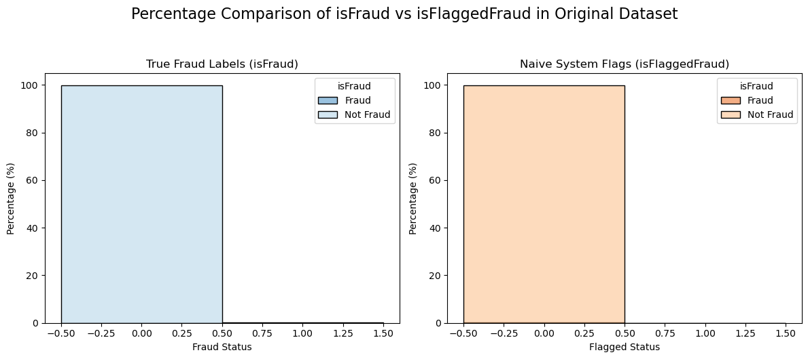
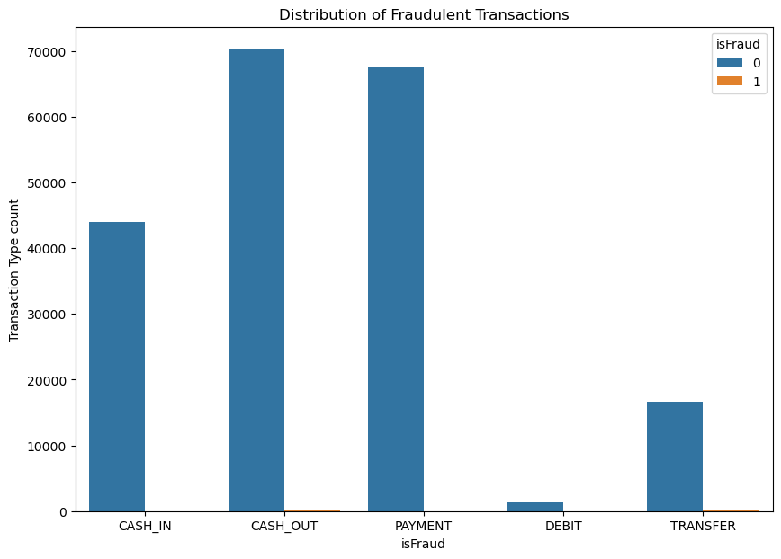
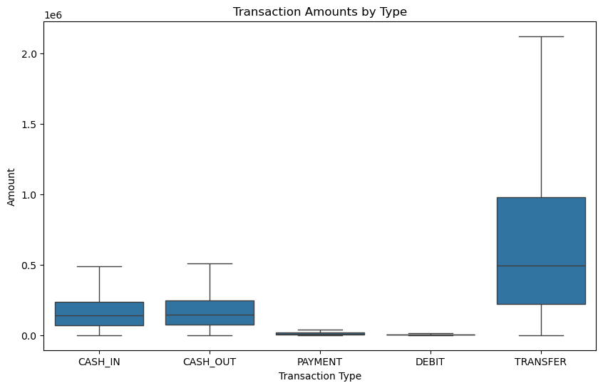
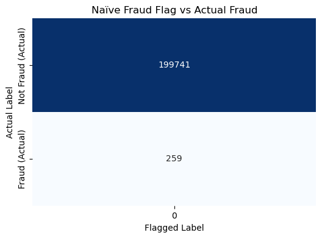
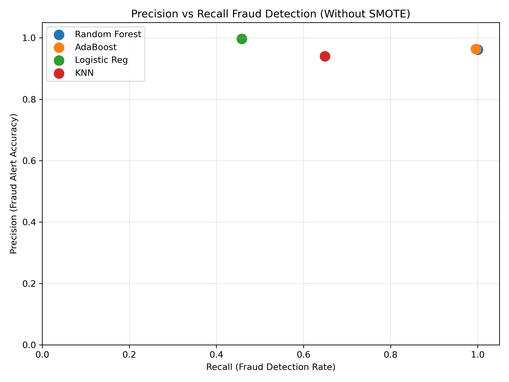

# ML Fraud Detection — Transaction Fraud Classification Pipeline

<div align="center">
  
</div>

> Part of the DataInsideData™ technical portfolio monorepo.

**Fari Lindo • DataInsideData™**

**Role:** Data Analyst & Applied AI Engineer

Applied Supervised Machine Learning Case Study | Classification + Imbalanced Data + Model Evaluation

## Tech Stack


---


---


[](LICENSE)

---

## Overview

This project explores the design of a machine learning pipeline for **fraud detection** using a large transaction dataset containing **1 million bank transactions**.

The case study is framed around a realistic business objective: helping a financial institution improve its ability to detect fraudulent customer-facing account activity while avoiding the false confidence that can come from relying on raw accuracy alone.

Because fraudulent transactions are rare, this project focuses on one of the most important challenges in applied fraud detection:

**class imbalance**.

In highly imbalanced datasets, a model can appear accurate simply by predicting every transaction as non-fraudulent. That approach may produce high accuracy, but it completely fails at the actual business goal: identifying fraudulent behavior.

This project therefore emphasizes a more meaningful workflow:

- exploratory analysis to understand transaction patterns
- preprocessing and feature preparation for predictive modeling
- model selection for a binary classification task
- evaluation using metrics that matter in fraud settings
- hyperparameter tuning to improve model performance on the minority class

---

## Business Problem

A Zurich-based international bank, **Caishen**, wants to improve fraud detection performance across customer-facing accounts.

The long-term goal is ambitious: identify **99% of fraudulent activity** while maintaining a usable detection system.

This creates an important analytical challenge:

A naive classifier can achieve very high accuracy by predicting every transaction as legitimate, but such a model would miss every fraudulent case.

The real task is therefore not just to build a classifier, but to build one that achieves **non-zero precision, recall, and sensitivity** in an imbalanced setting.

---

## Project Goal

The goal of this project is to build a **meaningful fraud detection pipeline** that moves from:

```text
EDA → preprocessing → feature preparation → model training → evaluation → tuning
```

The project is structured across three notebooks:

- `eda.ipynb`
- `transform.ipynb`
- `model_train.ipynb`

Together, these notebooks document the full applied machine learning workflow from analysis to model development.

---

## Executive Summary

This project demonstrates how to approach a fraud detection problem where the target class is rare and business risk is high.

Key themes include:

- fraud detection as a **binary classification** problem
- the limitations of raw accuracy in imbalanced datasets
- the importance of feature selection and preprocessing
- the need for metrics such as precision, recall, and sensitivity
- the value of comparing model behavior rather than assuming one default approach

The analytical workflow is intentionally staged:

1. Explore transaction behavior and identify suspicious patterns.
2. Prepare the dataset by removing non-predictive fields and encoding usable features.
3. Train and compare classification models suited to the task.
4. Evaluate model performance using fraud-relevant metrics.
5. Improve performance through hyperparameter search and iterative refinement.

---

## 📊 Visual Highlights

These visuals highlight the core analytical patterns that shaped the fraud detection workflow — from transaction behavior and class imbalance challenges to the limitations of a naïve fraud flag.

---

### Figure 1: Naive Fraud Flag vs Actual Fraud by Percentage

<div align="center">
  </div>

*<div align="center">Comparison between the built-in fraud flag (`IsFlaggedFraud`) and actual fraud outcomes. This highlights the gap between a simple rule-based alerting system and the more complex fraud patterns present in the data.</div>*

---

### Figure 2: Transaction Type Distribution by Fraud Status

<div align="center">
  </div>

*<div align="center">Distribution of transaction types across fraudulent and non-fraudulent observations. This view helps show that fraud is not spread evenly across all transaction activity and instead appears more concentrated in certain transaction categories.</div>*

---

### Figure 3: Transaction Amount by Type

<div align="center">
  </div>

*<div align="center">Transaction amount distributions across transaction types. This chart helps identify how transaction behavior differs by category and whether certain transaction types tend to cluster around higher-value activity.</div>*

---

## Why the Naïve Fraud Flag Was Not Enough

The dataset includes a built-in rule-based fraud flag (`IsFlaggedFraud`), but exploratory analysis showed that this signal does not align well with actual fraudulent outcomes.

This matters because a rule-based threshold can appear useful operationally while still failing to identify the real fraud patterns present in the data.

A simple comparison of the rule-based fraud flag against the true labels shows the problem clearly:

```text
╒════════════════╤════════╕
│   Actual Fraud │      0 │
╞════════════════╪════════╡
│              0 │ 199741 │
├────────────────┼────────┤
│              1 │    259 │
╘════════════════╧════════╛
TP: 0, FP: 0, FN: 259, TN: 199741
```

<div align="center">
  </div>

*<div align="center">Confusion-style comparison between the built-in fraud flag and the true fraud label. The naïve flag failed to meaningfully identify actual fraud cases.</div>*

---

## Model Performance Summary

This project evaluated multiple binary classification models in an imbalanced fraud detection setting.

Because fraudulent transactions are rare, model performance was not judged by raw accuracy alone. In a dataset like this, a model can achieve very high accuracy simply by predicting every transaction as non-fraudulent. That kind of result may look strong numerically while failing completely at the actual business objective.

For that reason, evaluation focused on metrics that better reflect fraud detection usefulness, including:

- precision
- recall
- sensitivity
- F1 score
- confusion matrix behavior
- ROC-AUC / PR-AUC where appropriate

### Key Modeling Insight

A central finding from this project is that improving fraud recall does not automatically produce a better model in practice.

In highly imbalanced settings, some techniques can improve the detection of fraudulent cases while also sharply increasing false positives. In a real banking workflow, that tradeoff matters because excessive false alerts can reduce operational usefulness and overwhelm downstream review processes.

### With vs Without SMOTE

Comparing models with and without SMOTE helped surface one of the most important practical tradeoffs in the project.

Using SMOTE can improve the model’s ability to detect the minority fraud class, but it may also reduce precision by generating substantially more false positives. That makes it important to evaluate not only whether a model catches more fraud, but also whether it remains usable in context.

The strongest model is therefore not necessarily the one with the highest recall in isolation, but the one that achieves the most useful balance between:

- identifying fraud
- limiting false alarms
- maintaining interpretable performance in context

This project treats fraud detection as a business-sensitive classification problem rather than a pure metric optimization exercise.

The evaluation framework used here emphasizes practical fraud detection performance rather than headline accuracy, which is especially important in highly imbalanced financial datasets.

---

### Figure 4: Model Performance — Precision vs Recall (Without SMOTE)

<div align="center">
  
</div>

*<div align="center">Comparison of model performance using fraud-class precision and recall without SMOTE. Random Forest and AdaBoost achieve perfect recall while maintaining high precision, indicating strong fraud detection capability with minimal false positives. Logistic Regression demonstrates perfect precision but significantly lower recall, highlighting a conservative model that avoids false alarms at the cost of missed fraud cases. K-Nearest Neighbors provides a more balanced tradeoff between precision and recall. This visualization emphasizes the importance of evaluating fraud detection models beyond accuracy, focusing instead on their ability to correctly identify rare fraudulent events.</div>*

---

### Figure 5: Model Performance — Precision vs Recall (With SMOTE)

<div align="center">
  </div>

*<div align="center">Confusion matrix for the selected fraud detection model. This view shows how well the model identifies fraudulent cases relative to false positives and missed fraud using SMOTE.</div>*

---

### Figure 6: Model Comparison — With SMOTE vs Without SMOTE

<div align="center">
  </div>

*<div align="center">Comparison of model performance with and without SMOTE. This chart highlights the tradeoff between improved minority-class recall and the potential cost of reduced precision in an imbalanced fraud detection setting.</div>*

---

## Key Findings

- Fraud is extremely rare in the dataset, making class imbalance the defining challenge of the modeling workflow.
- The built-in fraud flag does not fully capture true fraudulent behavior, showing the limits of simple threshold-based detection.
- Transaction type and transaction amount appear to carry useful predictive signal.
- Feature preparation and class imbalance handling significantly influence model behavior.
- Model evaluation must go beyond accuracy to focus on whether fraud is actually being detected.
- In this project, comparing models with and without SMOTE helped reveal the tradeoff between higher recall and lower precision.

---

## Project Workflow

### 1. Exploratory Data Analysis ([eda.ipynb](notebooks/eda.ipynb))

The first notebook focuses on understanding the dataset through univariate, bivariate, and multivariate exploration.

Key questions include:

- How are transaction amounts distributed?
- What distinguishes common transactions from rare, extreme ones?
- Do fraudulent transactions cluster in particular value ranges?
- How does transaction type relate to amount and fraud behavior?
- How well does the built-in fraud flag (`IsFlaggedFraud`) align with actual fraud?

This stage informs feature engineering and modeling decisions rather than serving as a purely descriptive exercise.

### 2. Data Transformation ([transform.ipynb](notebooks/transform.ipynb))

The second notebook prepares the data for machine learning.

This stage focuses on:

- removing non-predictive or identifying columns
- handling missing values if present
- encoding categorical variables such as transaction type
- addressing class imbalance
- engineering useful predictive features
- preparing a modeling-ready dataset

The goal is to ensure the model learns from meaningful transaction behavior rather than noisy or identifier-based columns.

### 3. Model Training ([model_train.ipynb](notebooks/model_train.ipynb))

The third notebook trains and evaluates classification models for fraud detection.

This stage includes:

- selecting appropriate binary classification models
- training candidate models
- comparing model behavior
- evaluating fraud-sensitive metrics
- tuning hyperparameters
- documenting tradeoffs between model performance measures

Because this is a fraud setting, model evaluation extends beyond simple accuracy and focuses on whether the model can actually identify fraudulent cases.

---

## Data Dictionary

This dataset contains a mix of numerical and categorical variables.

| Column | Description |
|---|---|
| `Type` | Type of transaction |
| `Amount` | Amount of money transferred |
| `NameOrig` | Origin account name |
| `OldBalanceOrg` | Origin account balance before the transaction |
| `NewBalanceOrig` | Origin account balance after the transaction |
| `NameDest` | Destination account name |
| `OldbalanceDest` | Destination account balance before the transaction |
| `NewbalanceDest` | Destination account balance after the transaction |
| `IsFlaggedFraud` | Naïve system fraud flag for very large transactions |
| `IsFraud` | Actual fraud label (target variable) |

### Modeling Note

Not all fields are equally useful for prediction.

In particular, account-identifying columns such as `NameOrig` and `NameDest` are likely to be poor predictors for a generalized fraud model and may introduce noise or overfitting risk.

This project therefore focuses primarily on numerical predictors and transformed behavioral features.

---

## Machine Learning Framing

### Prediction Task

- **Task type:** Classification
- **Target structure:** Binary classification
- **Target variable:** `IsFraud`

### Core Challenge

The dataset is imbalanced, meaning fraudulent cases represent a small minority of all transactions.

This makes metric choice especially important.

### Metrics of Interest

Depending on the final implementation, model evaluation should prioritize metrics such as:

- precision
- recall
- sensitivity
- F1 score
- confusion matrix behavior
- ROC-AUC / PR-AUC where appropriate

In fraud detection, recall and sensitivity are especially important because missed fraud can be more costly than many other classification errors.

---

## Repository Structure

```text
ml-fraud-detection/
├─ assets/
│  ├─ charts/
│  │  ├─ naive-flag-vs-actual-fraud-percentage.png
│  │  ├─ naive-fraud-flag-confusion-matrix.png
│  │  ├─ transaction-amount-by-type.png
│  │  ├─ transaction-type-by-fraud.png
│  │  ├─
│  │  └─ 
│  └─ images/
├─ notebooks/
│  ├─ eda.ipynb
│  ├─ transform.ipynb
│  └─ model_train.ipynb
├─ .gitignore
├─ ds-env.yml
├─ requirements.txt
└─ README.md
```

---

## How to Run

> Python 3.10+ recommended.

### Clone the Portfolio Repository

```bash
git clone https://github.com/dataeden/fari-tech-portfolio.git
cd fari-tech-portfolio/applied-data-science-machine-learning/ml-fraud-detection/
```

### Option A — Using venv

```bash
python -m venv venv
source venv/bin/activate  # Mac/Linux
venv\Scripts\activate     # Windows

pip install -r requirements.txt
jupyter lab
```

### Open the Project Notebooks

Run the notebooks in the following order:

1. `eda.ipynb`
2. `transform.ipynb`
3. `model_train.ipynb`

This preserves the analytical flow from exploration to model training.

### Option B — Using Conda

```bash
conda env create -f ds-env.yml
conda activate <your-env-name>
jupyter lab
```

---

## Analytical Questions Addressed

### EDA Questions

- How are numeric transaction features distributed?
- What do rare and extreme values suggest about transaction behavior?
- Are fraudulent transactions concentrated in certain regions of the feature space?
- How do transaction types differ in amount and fraud behavior?
- How well does `IsFlaggedFraud` align with true fraud outcomes?

### Data Transformation Questions

- Which columns are non-predictive or should be removed?
- How should transaction type be transformed for modeling?
- What problems does class imbalance create during training?
- What strategies can help the model learn from the minority class?
- Are there useful interaction features worth engineering?

### Model Selection Questions

- Is this a classification or regression task?
- Is the target binary or multi-class?
- Which machine learning models make sense for this problem?
- How do the candidate models compare once evaluated?

---

## Key Skills Demonstrated

- exploratory data analysis for ML preparation
- feature selection and transformation
- handling imbalanced classification problems
- categorical encoding and preprocessing
- model comparison and evaluation
- hyperparameter search
- notebook-based machine learning workflow
- evidence-based interpretation of model behavior

---

## Project Significance

Fraud detection is one of the clearest examples of why machine learning evaluation must be aligned with business reality.

This project highlights an important principle in applied data science:

> A model that looks accurate on paper can still fail completely in practice.

By focusing on class imbalance, fraud-sensitive metrics, and structured preprocessing, this project emphasizes the difference between simply fitting a model and building one that is useful in context.

---

## Attribution

This project originated from a learning prompt completed during **The Knowledge House fellowship**.

The project is being organized and expanded as part of my professional portfolio, with emphasis on clearer workflow structure, applied ML framing, and reproducible documentation.

---

## Future Enhancements

### Modeling Improvements

- compare additional classification models
- add calibration analysis
- test threshold tuning for recall / precision tradeoffs
- explore resampling strategies in greater depth
- evaluate feature importance more explicitly

### Product / System Extensions

- refactor notebooks into reusable pipeline modules
- add experiment tracking
- create a lightweight dashboard for model results
- expose the workflow as a small fraud detection demo app
- expand documentation into a full ML case study page

---

## Contact

### Fari Lindo • DataInsideData™

- [GitHub](https://github.com/dataeden)
- [Portfolio](https://datainsidedata.com)
- [LinkedIn](https://www.linkedin.com/in/fari-lindo/)
- [Email](mailto:contact@datainsidedata.com)

*Tech Hands, a Science Mind, and a Heart for Community™*
