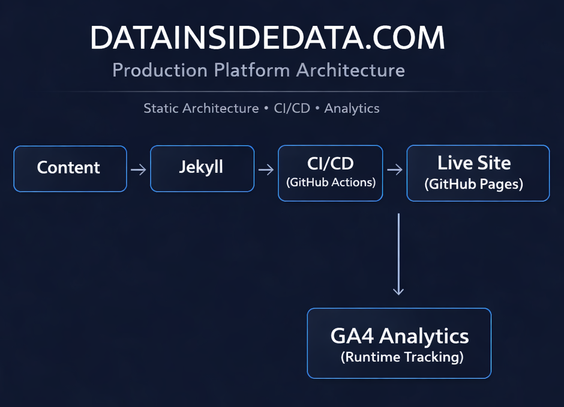
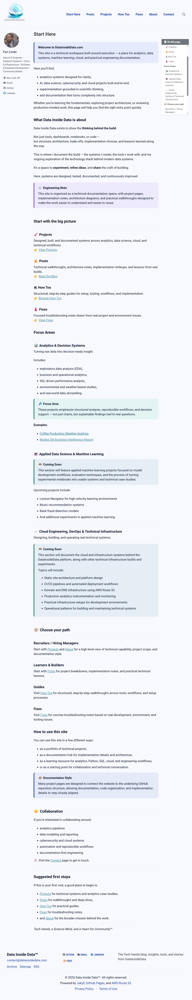
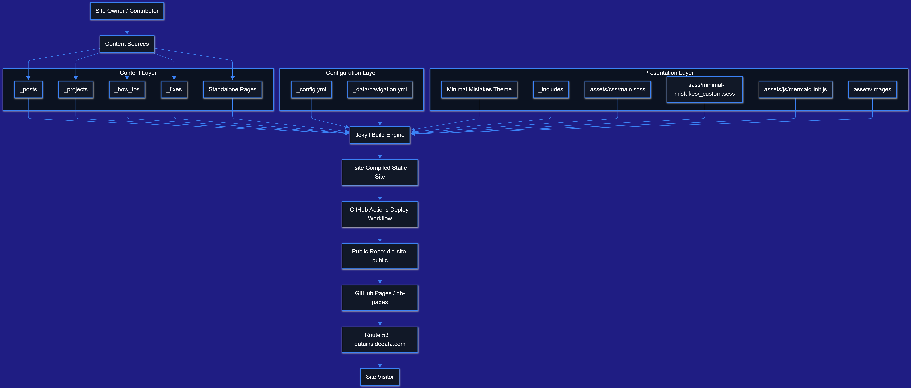
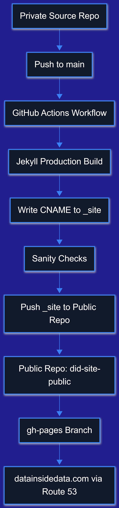
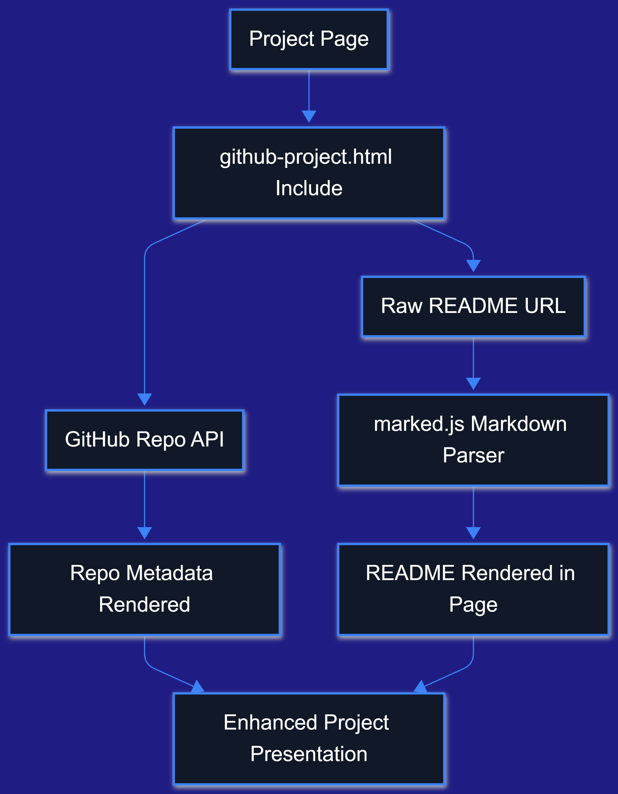
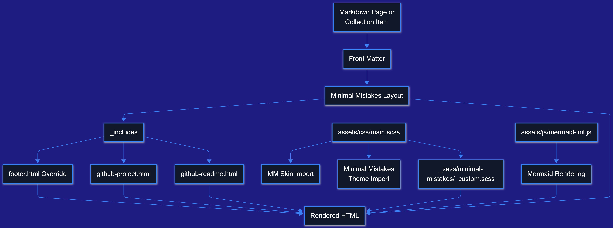
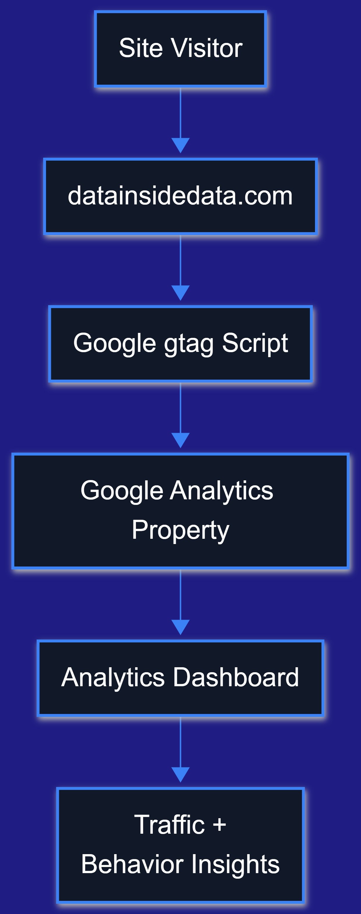
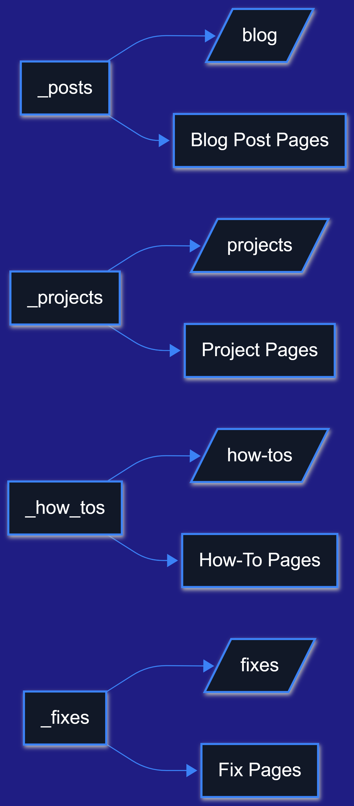
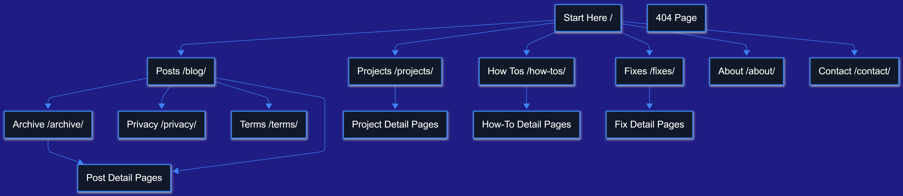

<div align="center"> 
  
</div>

# DataInsideData.com Platform Architecture

> Part of the DataInsideData™ technical portfolio monorepo.

**Fari Lindo • DataInsideData™**

**Role:** Technical Builder — Analytics, CI/CD, Cloud Deployment, Systems Engineering, and Static Platform Architecture

---

## Domains Represented


## Implementation Stack


---

## Overview

This project documents the live production platform architecture behind **DataInsideData.com**.

It is not simply a website theme implementation or front-end presentation exercise. It is a layered technical system that combines static site generation, content architecture, collection-based publishing, analytics instrumentation, continuous deployment, cloud DNS integration, and documentation-driven project rendering.

The platform is built using **Jekyll** and **Minimal Mistakes**, deployed through **GitHub Actions** and **GitHub Pages**, routed through **AWS Route 53**, and instrumented with **Google Analytics 4** in production builds.

The broader objective is to create a scalable technical publishing platform that supports multiple project domains across analytics, systems engineering, cloud workflows, and technical documentation.

---

## Executive Summary

DataInsideData.com is built as a production-oriented static publishing platform rather than a simple portfolio site.

The architecture separates authoring, build, deployment, domain routing, and analytics into clear functional layers. A private source-of-truth workflow governs editable content and implementation logic, while a public deployment repository serves the compiled hosting output for the live site.

This structure supports:

- cleaner separation of concerns
- safer publishing boundaries
- scalable project documentation workflows
- maintainable theme customization
- production-aware analytics
- future growth across multiple technical domains

This project demonstrates practical platform thinking at the intersection of analytics, CI/CD, cloud deployment, systems engineering, and structured static publishing.

---

## What This Project Demonstrates

- production static site architecture
- Minimal Mistakes migration and disciplined override strategy
- collection-based content publishing with Jekyll
- reusable include-driven project rendering
- GitHub-backed README presentation flow
- CI/CD deployment through GitHub Actions
- GitHub Pages hosting via a public build artifact repo
- custom domain routing through AWS Route 53
- production-only GA4 telemetry injection
- monorepo-friendly documentation architecture for multiple technical domains

---

## Live Platform Links

- **Live Site:** [DataInsideData.com](https://datainsidedata.com)
- **Public Deployment Repository:** [did-site-public](https://github.com/DataEden/did-site-public)
- **Monorepo Project Folder:** [DATAINSIDEDATA/](https://github.com/DataEden/fari-tech-portfolio/tree/main/cloud-devops-engineering/datainsidedata/)

---

## Why This Project Matters

This project reflects how I approach technical systems: as layered, maintainable platforms rather than isolated files or one-off builds.

It demonstrates:

- migration planning over reactive customization
- structured content architecture over ad hoc page sprawl
- deployment automation over manual publishing
- documentation-driven workflows over duplicated content maintenance
- production-minded thinking about telemetry, hosting, and system boundaries

For hiring managers, collaborators, and technical reviewers, this project shows a practical systems view of how content, code, automation, and infrastructure fit together.

---

## Architecture at a Glance

### Homepage View

<div align="center"> 
  
  
  Homepage view of the Data Inside Data platform, showing the navigation, documentation layout, sidebar profile, and on-page table of contents.
</div>

---

## Diagram Source vs Rendered Output

All diagrams are authored in Mermaid under `/diagrams` and exported as presentation-ready images under `/images`.

This separation ensures:

- diagrams remain editable and version-controlled
- presentation assets remain optimized for documentation and rendering

<div align="center"> 
  
  
  High-level system overview showing content sources, Jekyll build flow, deployment pipeline, and live delivery through GitHub Pages and Route 53.
</div>

---

## High-Level Platform Model

DataInsideData.com is organized into several major layers:

### 1. Content Layer

The platform includes structured publishing sources such as:

- posts
- projects
- how-tos
- fixes
- standalone pages

These content sources are designed to scale across multiple technical domains while staying organized and discoverable.

### 2. Configuration Layer

Core platform behavior is controlled through:

- `_config.yml`
- collection definitions
- defaults
- navigation data files
- analytics settings
- theme configuration

### 3. Presentation Layer

Rendering is handled through:

- Jekyll
- Minimal Mistakes layouts
- include-driven components
- SCSS overrides
- client-side README rendering for selected project pages

### 4. Build and Deployment Layer

The site is compiled and deployed through:

- GitHub Actions
- production build workflow
- compiled `_site` publishing
- public deployment repository
- GitHub Pages serving layer

### 5. Infrastructure Layer

Production delivery includes:

- Route 53 DNS management
- custom domain routing
- GitHub Pages domain mapping
- CNAME handling

### 6. Observability Layer

Analytics and telemetry are handled through:

- GA4 integration
- production-only injection
- future extensibility for event tracking

---

## Two-Repository Deployment Model

A key architectural decision in this platform is the separation of authoring from deployment.

### Private Source-of-Truth Layer

The editable implementation lives in the source repository and includes:

- content
- layouts
- includes
- SCSS
- assets
- configuration
- workflow logic

### Public Deployment Layer

The public repository exists to serve compiled output for hosting.

This repository functions as the deployment artifact layer rather than the primary authoring environment.

### Why this matters

This separation improves:

- maintainability
- deployment clarity
- source control discipline
- reduced exposure of internal-only materials
- professional publishing structure

---

## Deployment Flow

<div align="center"> 
  
  
  End-to-end deployment flow from private source repository through GitHub Actions build pipeline to public hosting via GitHub Pages and Route 53.
</div>

---

## Monorepo + Project Rendering Model

This platform supports a monorepo-style workflow where individual project folders can maintain their own documentation and be surfaced into the site.

For selected project pages, the website dynamically retrieves a README from a repository subfolder and renders it into the page through custom include components.

This allows the repository to remain the single source of truth while the website acts as the presentation layer.

### Benefits of this approach

- reduces duplicated documentation
- keeps project documentation synchronized
- supports consistent project presentation
- scales well across multiple technical domains
- aligns with portfolio-as-platform thinking

---

## Documentation Rendering Flow

<div align="center"> 
  

  <p>
    <em>Documentation rendering flow showing how repository README files are retrieved, processed, and displayed within project pages through custom include components.</em>
  </p>
</div>

---

## Minimal Mistakes and Theme Strategy

Minimal Mistakes was chosen not simply for aesthetics, but for architecture.

It provides:

- collection support
- structured layouts
- responsive navigation
- search support
- TOC support
- archive patterns
- author profile options
- scalable theme conventions

The project follows a deliberate override strategy:

- let the theme load clean defaults first
- avoid local include collisions from legacy themes
- override intentionally rather than reactively
- centralize styling in SCSS rather than scattered CSS fragments

This allowed the platform to move from a simpler learning-stage setup toward a more maintainable publishing framework.

---

## Theme / Rendering Architecture

<div align="center"> 
  

Rendering architecture showing how Markdown, front matter, layouts, includes, custom components, and SCSS are combined into the final compiled static site.
</div>

---

## Analytics and Observability

The platform integrates **Google Analytics 4** as part of the production publishing architecture.

Analytics configuration is controlled through Jekyll config and is injected only when the build environment is set to production. This prevents local development traffic from polluting live measurement.

### What this demonstrates

- production-aware telemetry handling
- clean separation between local development and live analytics
- observability as part of platform design
- future readiness for richer event instrumentation

### Current and future telemetry scope

Current or planned observability use cases include:

- page views
- traffic sources
- user navigation behavior
- project page engagement
- outbound repository click tracking
- future event-level instrumentation

---

## Analytics Flow

<div align="center"> 
  

  <p>
    <em>Analytics flow illustrating how user interactions on the live site are captured through GA4 and routed into reporting and insight workflows.</em>
  </p>
</div>

---

## Projects Collections Architecture

**What this diagram shows**

- Project pages can dynamically enrich themselves with GitHub data.
- Repo metadata and README content are fetched separately.
- The rendered result becomes a richer project showcase page.

**Why it matters**

- This is a strong portfolio feature.
- It also documents a custom behavior future contributors would not know from theme defaults alone.

## Projects Collection Flow

<div align="center"> 
  

Diagram depicting collection architecture.
</div>

---

## Platform in Action

<div align="center"> 
  

Diagram depicting how users experience the public site.
</div>

---

## Key Technical Components

- **Jekyll** for static site generation
- **Minimal Mistakes** for structured theme architecture
- **GitHub Actions** for automated build and deploy workflows
- **GitHub Pages** for static hosting
- **AWS Route 53** for DNS and custom domain routing
- **GA4** for production telemetry
- **SCSS** for maintainable theme-aware styling
- **Markdown + README workflows** for documentation-driven publishing
- **Custom include components** for GitHub-backed project presentation

---

## Repository Structure

```text
DATAINSIDEDATA/
├─ docs/
│  ├─ architecture-notes.md
│  ├─ migration-notes.md
│  └─ deployment-notes.md
├─ diagrams/                      # SOURCE OF TRUTH (Mermaid / thinking)
│  ├─ system-overview.md
│  ├─ platform-architecture.md
│  ├─ deployment-flow.md
│  ├─ rendering-flow.md
│  ├─ theme-rendering-flow.md
│  ├─ projects-collection.md
│  └─ analytics-flow.md
├─ images/                        # RENDERED OUTPUT (for site / README)
│  ├─ analytics-flow.png
│  ├─ deployment-flow.png
│  ├─ hero-platform-visual.png
│  ├─ homepage-view.png
│  ├─ projects-collection.png  
│  ├─ rendering-flow.png
│  ├─ site-map.png
│  ├─ system-overview.png
│  └─ theme-rendering-flow.png   
├─ references/
   ├─ config-snippets.md
   └─ workflow-snippets.md
```

---

## Operational Notes

This project documents a platform that is both live and still evolving.

That means the architecture is intentionally designed for iterative growth, including:

- additional content domains
- stronger taxonomy layers
- deeper project metadata integration
- future tags and discovery systems
- event tracking improvements
- richer documentation rendering controls
- further platform hardening as the site scales

## Skills Demonstrated

- systems thinking
- platform architecture
- CI/CD workflow design
- static site deployment
- cloud-integrated delivery
- structured documentation systems
- analytics instrumentation
- scalable content modeling
- maintainable theme customization
- portfolio platform engineering

## Public Repository Note

The public deployment repository linked above represents the hosting and delivery layer for the live site.

It is shared to provide transparency into the generated deployment structure, but it is not the editable source-of-truth authoring environment for the platform.

The primary implementation workflow remains centered on the source repository and project architecture documented here.

## Future Enhancements

### Platform Enhancements

- stronger domain-based project taxonomy
- filtered project discovery by technical domain
- richer project metadata cards
- expanded architecture documentation
- more formal contributor / maintainer notes
- improved README rendering controls
- optional pre-processing for documentation ingestion

### Analytics Enhancements

- custom event tracking for outbound GitHub clicks
- engagement tracking on project pages
- page-type comparison dashboards
- content performance analysis
- architecture-level observability improvements

### Publishing Enhancements

- domain landing pages
- tags page
- advanced archive browsing
- content relationship mapping
- improved discovery across technical domains

## Contact

### Fari Lindo • DataInsideData™

- [GitHub](https://github.com/dataeden)
- [Portfolio](https://datainsidedata.com)
- [LinkedIn](https://www.linkedin.com/in/fari-lindo/)
- [Email](mailto:contact@datainsidedata.com)

*Tech Hands, a Science Mind, and a Heart for Community™.*
