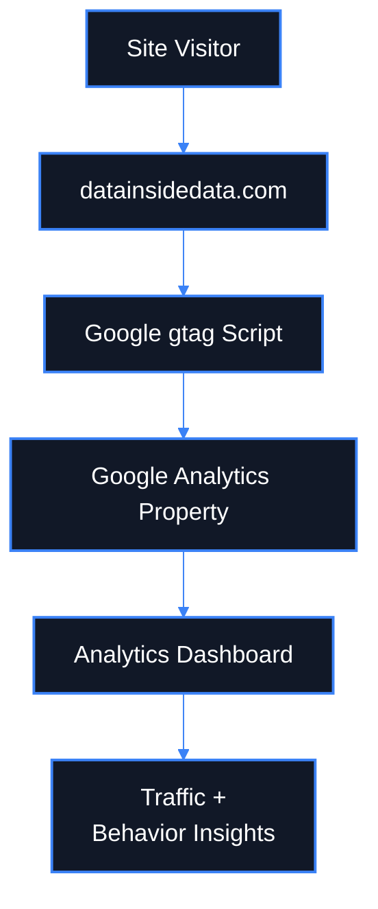

# Analytics & Observability Architecture

```mermaid
%%{init: {
  "theme": "base",
  "themeVariables": {
    "background": "#0b1220",
    "lineColor": "#3b82f6",
    "fontSize": "18px",
    "fontFamily": "Arial",
    "textColor": "#ffffff",
    "primaryTextColor": "#ffffff",
    "secondaryTextColor": "#e5e7eb"
  }
}}%%
flowchart TB

%% GLOBAL NODE STYLE
  classDef default fill:#111827,stroke:#3b82f6,stroke-width:2px,color:#ffffff;

  VISITOR[Site Visitor] --> SITE[datainsidedata.com]

  SITE --> SCRIPT[Google gtag Script]

  SCRIPT --> GA4[Google Analytics Property]

  GA4 --> DASH[Analytics Dashboard]

  DASH --> INSIGHTS[Traffic + </br>Behavior Insights]
```
