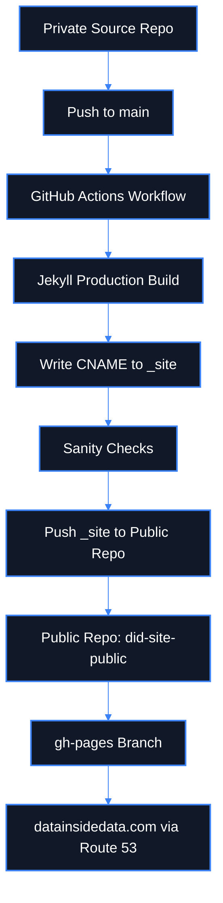

# Deployment Flow — Two Repo Strategy

```mermaid
%%{init: {
  "theme": "base",
  "themeVariables": {
    "background": "#0b1220",
    "lineColor": "#3b82f6",
    "fontSize": "18px",
    "fontFamily": "Arial",
    "textColor": "#ffffff",
    "primaryTextColor": "#ffffff",
    "secondaryTextColor": "#e5e7eb"
  }
}}%%
flowchart TB

  %% GLOBAL NODE STYLE
  classDef default fill:#111827,stroke:#3b82f6,stroke-width:2px,color:#ffffff;

  SRC[Private Source Repo] --> PUSH[Push to main]
  PUSH --> ACTIONS[GitHub Actions Workflow]
  ACTIONS --> BUILD[Jekyll Production Build]
  BUILD --> CNAME[Write CNAME to _site]
  CNAME --> VERIFY[Sanity Checks]
  VERIFY --> PUBLISH[Push _site to Public Repo]
  PUBLISH --> PUBLIC[Public Repo: did-site-public]
  PUBLIC --> GHPAGES[gh-pages Branch]
  GHPAGES --> DOMAIN[datainsidedata.com via Route 53]
```
