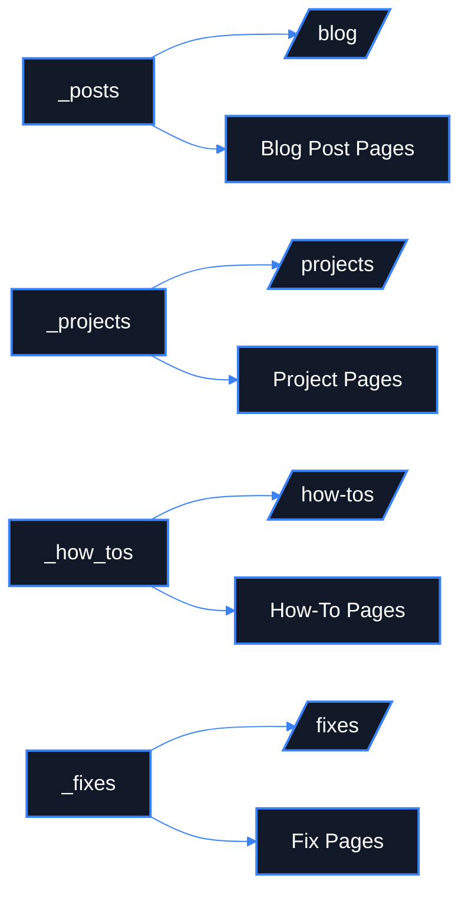

# Collection Architecture

**What this diagram shows**

- Each collection has a source folder and a public-facing hub.
- The hub and the item pages are separate concepts.
- Jekyll generates item pages from collection entries.

**Why it matters**

- This makes it easier to explain where to place new content.
- It also helps maintain clean boundaries between content types.
