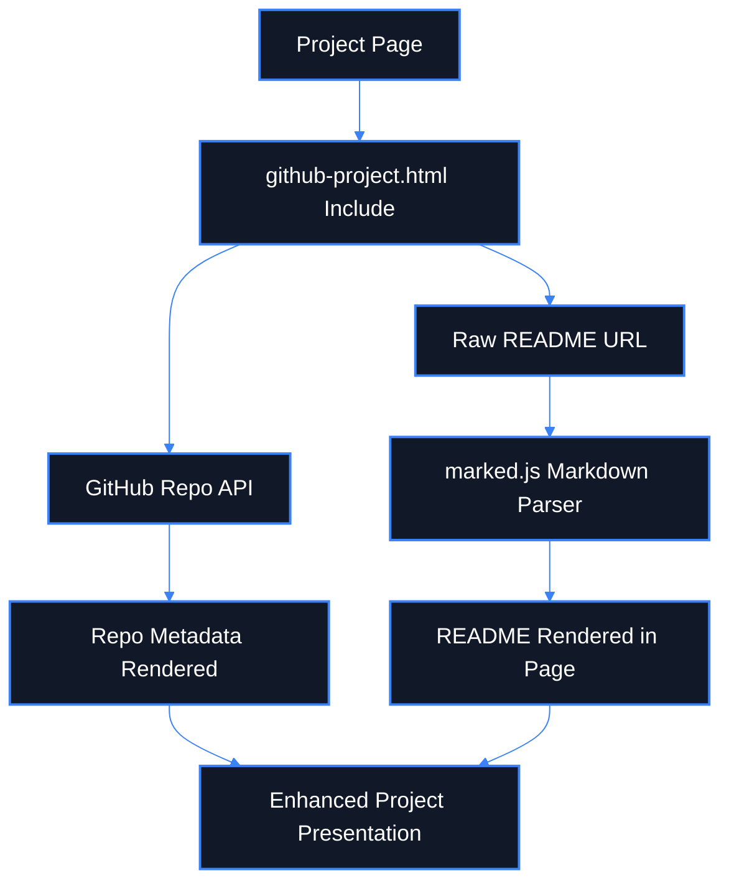

# GitHub Project Embed Flow

**What this diagram shows**

- Project pages can dynamically enrich themselves with GitHub data.
- Repo metadata and README content are fetched separately.
- The rendered result becomes a richer project showcase page.

**Why it matters**

- This is a strong portfolio feature.
- It also documents a custom behavior future contributors would not know from theme defaults alone.
