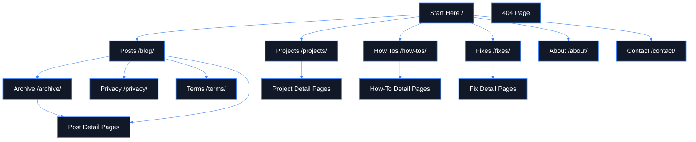

# Public Site Map / Navigation Flow

```mermaid
%%{init: {
  "theme": "base",
  "themeVariables": {
    "background": "#0b1220",
    "lineColor": "#3b82f6",
    "fontSize": "18px",
    "fontFamily": "Arial",
    "textColor": "#ffffff",
    "primaryTextColor": "#ffffff",
    "secondaryTextColor": "#e5e7eb"
  }
}}%%
flowchart TD

classDef default fill:#111827,stroke:#3b82f6,stroke-width:2px,color:#ffffff;
classDef subgraphStyle fill:#0b1220,stroke:#3b82f6,stroke-width:2px,color:#ffffff;

  HOME[Start Here /]
  BLOG[Posts /blog/]
  PROJECTS[Projects /projects/]
  HOWTOS[How Tos /how-tos/]
  FIXES[Fixes /fixes/]
  ABOUT[About /about/]
  CONTACT[Contact /contact/]
  ARCHIVE[Archive /archive/]
  PRIVACY[Privacy /privacy/]
  TERMS[Terms /terms/]
  NOTFOUND[404 Page]

  HOME --> BLOG
  HOME --> PROJECTS
  HOME --> HOWTOS
  HOME --> FIXES
  HOME --> ABOUT
  HOME --> CONTACT

  BLOG --> ARCHIVE
  BLOG --> PRIVACY
  BLOG --> TERMS

  PROJECTS --> PROJECT_DETAIL[Project Detail Pages]
  HOWTOS --> HOWTO_DETAIL[How-To Detail Pages]
  FIXES --> FIX_DETAIL[Fix Detail Pages]
  BLOG --> POST_DETAIL[Post Detail Pages]

  ARCHIVE --> POST_DETAIL
```
