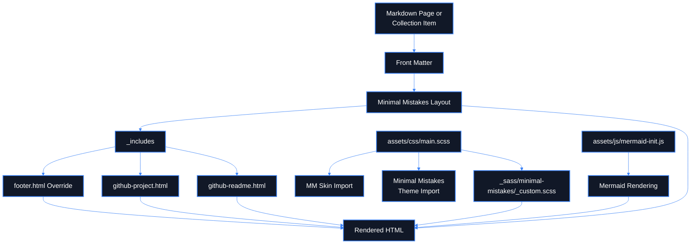

# Rendering / Theme Dependency Diagram

```mermaid
%%{init: {
  "theme": "base",
  "themeVariables": {
    "background": "#0b1220",
    "lineColor": "#3b82f6",
    "fontSize": "18px",
    "fontFamily": "Arial",
    "textColor": "#ffffff",
    "primaryTextColor": "#ffffff",
    "secondaryTextColor": "#e5e7eb"
  }
}}%%
flowchart TB

classDef default fill:#111827,stroke:#3b82f6,stroke-width:2px,color:#ffffff;
classDef subgraphStyle fill:#0b1220,stroke:#3b82f6,stroke-width:2px,color:#ffffff;

  PAGE[Markdown Page or </br>Collection Item] --> FM[Front Matter]
  FM --> LAYOUT[Minimal Mistakes Layout]
  LAYOUT --> INC[_includes]

  INC --> FOOTER[footer.html Override]
  INC --> GHPROJ[github-project.html]
  INC --> GHREADME[github-readme.html]

  SCSS_ENTRY[assets/css/main.scss] --> MM_SKIN[MM Skin Import]
  SCSS_ENTRY --> MM_THEME[Minimal Mistakes </br>Theme Import]
  SCSS_ENTRY --> CUSTOM_SCSS[_sass/minimal-mistakes/_custom.scss]

  JS_INIT[assets/js/mermaid-init.js] --> MERMAID[Mermaid Rendering]

  LAYOUT --> OUTPUT[Rendered HTML]
  FOOTER --> OUTPUT
  GHPROJ --> OUTPUT
  GHREADME --> OUTPUT
  CUSTOM_SCSS --> OUTPUT
  MERMAID --> OUTPUT
```
