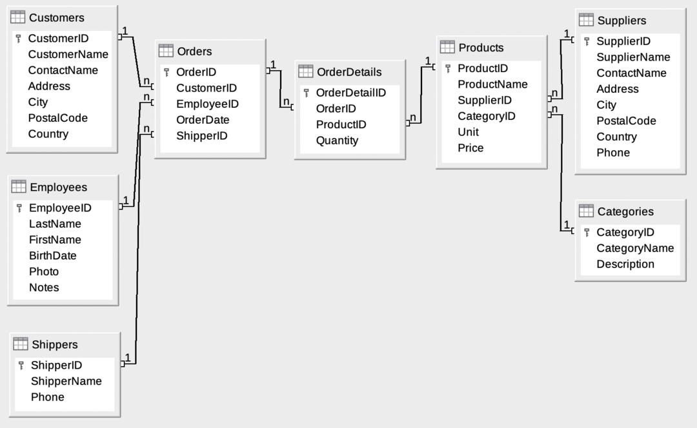
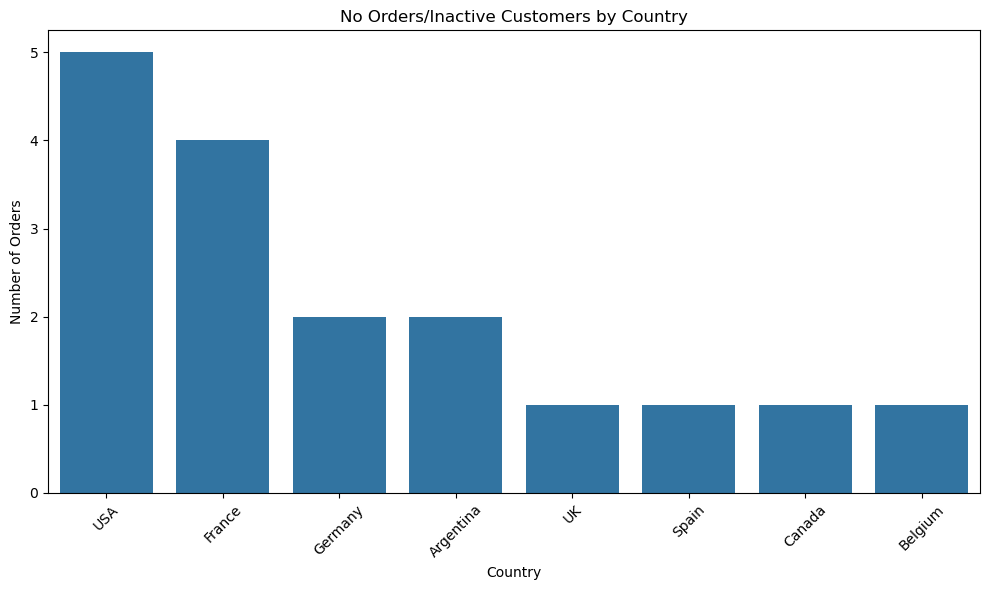
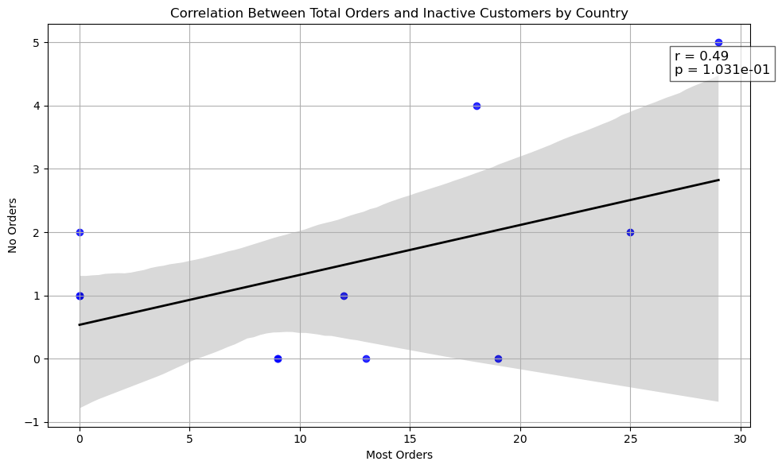
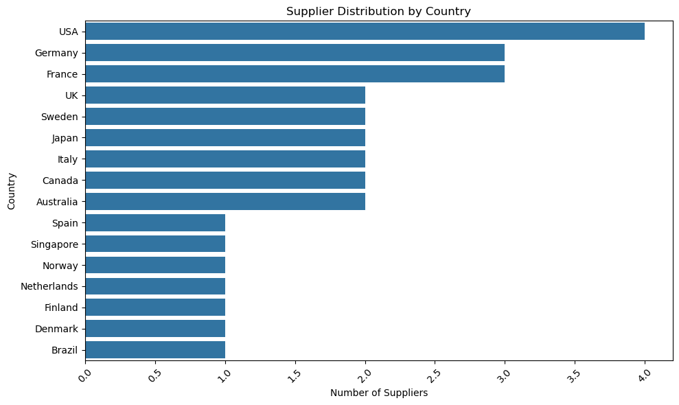

# Market.db Business Performance Report

**Fari Lindo • DataInsideData™**

**Role:** Data Analyst (Portfolio Project)

Business Intelligence Case Study | SQL + Python

## Tech Stack


---


[](LICENSE)

## Overview

This project is an ad-hoc business performance analysis using a
relational SQLite database (`Market.db`, Northwind-style schema).



**<div align="center">ERD Diagram of Market.db Schema</div>**

The objective was to simulate a real-world analyst workflow:

Interpret a normalized ERD, construct SQL queries to answer business questions,
validate outputs, and communicate findings using data visualizations and
statistical analysis.

> *All insights are supported by query outputs generated in the [Jupyter Notebook](/data-analysis/market-db-business-intelligence/notebooks/adhoc_report.ipynb)*.

---

## Executive Summary

- The United States is the dominant demand market, leading in total customers (13) and total orders (29). However, it also has the highest number of inactive customers (5), highlighting a clear re-engagement opportunity.

- Customer concentration and supplier presence are positively aligned by country (r = 0.69, p = 0.002), suggesting markets with higher demand tend to attract greater supplier participation. Notably, Brazil exhibits strong customer demand (9) but zero suppliers, indicating potential reliance on imports.

- Revenue performance is primarily volume-driven. A strong positive relationship exists between quantity ordered and total revenue (r = 0.69, p < 0.01), indicating that increasing sales volume is a key revenue lever.

- Product underperformance identified: Laughing Lumberjack Lager generated both the lowest quantity (5 units) and lowest total revenue (€70), suggesting pricing, positioning, or demand issues.

- Supplier participation is concentrated. Plutzer Lebensmittelgroßmärkte AG leads in order coverage (42 distinct orders), indicating both strategic importance and potential supplier dependency risk.

- Inactive customer patterns scale with market size. While countries with more orders tend to have more inactive customers (r = 0.49), the relationship is not statistically significant (p > 0.05), suggesting engagement gaps may vary by market maturity.

---

## 📊 Visual Highlights

**Figure 1: Inactive Customers by Country**



*<div align="center">Distribution of customers with zero orders across countries.</div>*

---

**Figure 2: Relationship Between Total Orders and Inactive Customers by Country (r = 0.49, p = 0.10)**



*<div align="center">Country-level scatter plot showing the relationship between total orders and customers with no orders. A moderate positive relationship is observed (r = 0.49), though not statistically significant (p > 0.05).</div>*

---

**Figure 3: Relationship Between Total Quantity Ordered and Total Revenue by Product (r = 0.69, p < 0.01)**


*<div align="center">Product-level scatter plot showing a strong positive relationship between quantity ordered and total revenue. Revenue performance is primarily volume-driven.</div>*

---

**Figure 4: Supplier Distribution by Country**



*<div align="center">Distribution of suppliers by country. The United States, Germany, and France have the highest supplier presence, aligning with customer concentration patterns.</div>*

---

## Detailed Analysis

### 1. Demand Concentration & Supplier Alignment

- The United States leads in both customer count (13) and total orders
(29). Germany (11 customers) and France (11 customers) follow.

- A statistically significant positive correlation exists between customer
count and supplier count by country (r = 0.69, p = 0.002).

- Brazil shows 9 customers but 0 suppliers, suggesting reliance on
imports. Japan, Sweden, and Australia show supplier presence without
customer concentration.

### 2. Revenue Drivers & Product Performance

- Revenue is strongly volume-driven (r = 0.69, p \< 0.01). Increasing
order frequency is likely a more impactful revenue lever than price
changes alone.

- Laughing Lumberjack Lager recorded 5 total units and €70 in revenue,
indicating potential pricing or demand issues.

### 3. Engagement Patterns & Inactive Customers

- The U.S. has both the highest order volume and highest inactive customer
count (5). While a moderate correlation exists between total orders and
inactive customers (r = 0.49), it is not statistically significant.

- Brazil and Austria show high order activity with zero inactive
customers.

### 4. Supplier Concentration & Coverage

- Plutzer Lebensmittelgroßmärkte AG leads in distinct order coverage (42
orders), followed closely by Pavlova Ltd.
- High supplier concentration may introduce dependency risk.

---

## Strategic Recommendations

1. Target inactive U.S. customers with retention initiatives.
2. Evaluate Brazil's supplier gap to assess distribution
    inefficiencies.
3. Review underperforming SKUs such as Laughing Lumberjack Lager.
4. Monitor supplier concentration risk.
5. Focus growth efforts on increasing order frequency.

---

## Data Source & Schema

**ERD file location:** `images/Northwind_E-R_Diagram.png`

### Core Tables Used

- **Customers** (`CustomerID`)
- **Orders** (`OrderID`, `CustomerID`, `ShipperID`)
- **OrderDetails** (`OrderID`, `ProductID`, `Quantity`)
- **Products** (`ProductID`, `SupplierID`, `Price`)
- **Suppliers** (`SupplierID`)
- **Shippers** (`ShipperID`)

### Join Relationships

    Customers (1) ──── (n) Orders
    Orders (1) ──── (n) OrderDetails
    Products (1) ──── (n) OrderDetails
    Suppliers (1) ──── (n) Products
    Shippers (1) ──── (n) Orders

---

## <center>Data Dictionary (Fields Used in Analysis)</center>

| Table        | Column     | Description                     |
|--------------|------------|---------------------------------|
| Products     | Price      | Unit selling price (EUR)        |
| OrderDetails | Quantity   | Units ordered per product line  |
| Orders       | OrderDate  | Date order was placed           |
| Customers    | Country    | Customer location               |
| Suppliers    | Country    | Supplier origin                 |
| Orders       | OrderID    | Unique transaction identifier   |

---

## Analyst Query Standards (SOP)

To ensure consistency and reproducibility:

- **Revenue Definition:** `Revenue = Quantity * Price`
- **Order Volume Metric:** Count of distinct `OrderID`
- **Supplier Popularity Metric:** Count of distinct orders containing
    products from a supplier
- **Inactive Customers:** Defined using `LEFT JOIN` where
    `OrderID IS NULL`
- **Null Handling:** Verified joins to prevent double-counting;
    `DISTINCT` used when aggregating across multi-line joins

---

## Business Questions Answered

This analysis addresses 8 core business questions:

1. Products priced under €10
2. Supplier country concentration
3. Customer country concentration
4. Least popular products by quantity
5. Least popular products by revenue
6. Countries with the most orders
7. Countries with inactive customers
8. Most popular suppliers by order participation

**Each section includes**:

- SQL query
- Result preview
- Visualization
- Evidence-based interpretation

---

## Repository Structure

    market-db-business-intelligence/
    ├─ db/
    │  └─ Market.db
    ├─ images/
    │  └─ northwind_er_diagram.png
    |  └─ countries-with-no-orders-by-number-of-customers.png
    |  └─ corr-bet-most-orders-and-no-orders-by-country.png
    |  └─ correlation-quantity-vs-revenue.png
    |  └─ number-of-suppliers-by-country.png
    ├─ notebooks/
    │  └─ adhoc_report.ipynb
    ├─ .gitignore
    ├─ LICENSE.txt 
    ├─ README.md
    ├─ requirements.txt 
---

## How to Run

> Python 3.10+ recommended.

### Option A — Using venv (Recommended)

```bash
python -m venv venv
source venv/bin/activate  # Mac/Linux
venv\Scripts\activate     # Windows

pip install -r requirements.txt
jupyter lab
```

### Option B — VS Code SQLite Viewer

Install the SQLite extension and open:

```bash
db/Market.db
```

You may also test queries in the terminal using:

```bash
sqlite3 db/Market.db
```

- For more information on interacting with the database from the terminal (shell), refer to this [guide](https://datacarpentry.github.io/sql-socialsci/instructor/08-sqlite-command-line.html).

---

## Key Skills Demonstrated

- Relational schema interpretation from ERD
- Multi-table joins across normalized structure
- Aggregations and grouped analysis
- Correlation analysis (Pearson r, p-values)
- Evidence-based business storytelling
- Clean, modular SQL and Python workflow

---

## Attribution

This project originated from a learning prompt during The Knowledge
House fellowship.
All analysis logic, statistical testing, visualization design, and
reporting narrative were independently rebuilt and expanded as part of
my professional portfolio.

---

## Future Enhancements

### Analytical Extensions

- Extend analysis to time-series revenue trends.
- Perform cohort-based customer retention analysis.
- Implement segmentation clustering for customer behavior.

### Technical Improvements

- Refactor SQL queries into reusable helper functions.
- Create a centralized query library for modular reuse.
- Implement SQL window functions for ranking and advanced aggregation.
- Parameterize notebook for scalability to additional datasets.
- Deploy as an interactive dashboard (Streamlit).

## Contact

### Fari Lindo • DataInsideData™

- [GitHub](https://github.com/dataeden)
- [Portfolio](https://datainsidedata.com)
- [LinkedIn](https://www.linkedin.com/in/fari-lindo/)  
- [Email](mailto:contact@datainsidedata.com)

*Tech Hands, a Science Mind, and a Heart for Community™*
